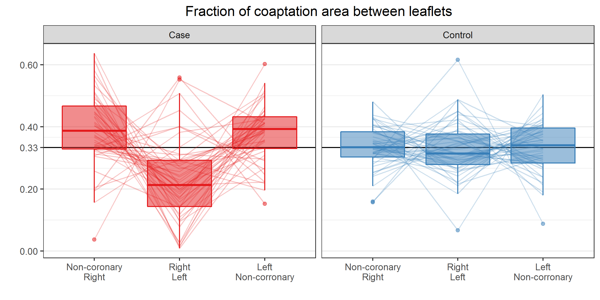

# PrintValve case-control analysis

Attribute | Value
:---|:---
Principal investigator | Michael Silberbach, silberbm@ohsu.edu, 503-494-3189
Main contact | Michael Silberbach, silberbm@ohsu.edu, 503-494-3189
Statistician | Benjamin Chan, chanb@ohsu.edu, 503-494-5491
eIRB # | 


## Objective

Compare cases (patients diagnosed with bicuspid aortic valves) and controls
(patients diagnosed with tricuspid aortic valves), and to describe the
geometry among the cases


## Delieverables

1. Between cases and controls, compare orifice area, coaptation area, ceiling
plane and bottom plane centroid points, and the centroid line (“triple line”)
angle relative to the ceiling plane and bottom plane and the centroid line
length. Provide statistical tests comparing cases and control.
2. Within cases, compare same variables as above, as well as coaptation area
in terms of the chart review that describes type of BAV fusion (RL, RN,
functional BAV), degree of insufficiency, degree of stenosis, age, BSA.
Provide descriptive statistics or central tendency (means or medians) and
variation (standard deviations, interquartile ranges, etc.).
3. Prepare presentation of results, including tables and figures.
4. Provide a draft of a methods section describing the statistical analysis
suitable for a peer-reviewed manuscript or grant submission.


## Results

Due to missing data, the sample size for each group is not 50.

|type    |  n|
|:-------|--:|
|Case    | 48|
|Control | 49|

### Compare leaflet coaptation fractions



* Among cases
  * NR and LN are not significantly different (p = 0.635)
  * RL is significantly different from NR and LN (p = 0.000)
* Among controls
  * NR and LN are not significantly different (p = 0.979)
  * RL is not significantly different from NR and LN (p = 0.855)
  * NR, RL, and LN are not significantly different from each other (p = 0.876)
* Between cases and controls
  * RL is significantly different (p = 0.000)

### Compare coaptation lines in 3D space

Observed coaptation lines.
[Interactive HTML](figures/webGL/sphereplotObservedCoapLines.html)

Predicted coaptation lines.
[Interactive HTML](figures/webGL/sphereplotPredictedCoapLines.html)

**Coaptation lines are not significantly different (p = 0.166).**
Adjust for scaled orifice area, `orificeAreaScaled`.


## Method

Example coaptation line (triple point) is below.
An interactive representation of the coaptation line geometry is [here](https://ggbm.at/CeF95YMN).


The ceiling points of all coaptation lines were shifted to coordinate (0, 0, 0).
Coaptation lines were compared using multivariate ANOVA (MANOVA) with the bottom plane coaptation line coordinates, ($x$, $y$, $z$), as the dependent vector.
Cohort membership (case versus control) was a main effect.
Orifice area (scaled) was included in the MANOVA model as a covariate as a proxy for body size.

Leaflet coaptation fractions were compared using a linear model.
The model included main effects for cohort membership (case versus control) and leaflet (NR, RL, or LN).
An interaction between cohort membership and leaflet was included, as well.
Linear contrasts were used to test comparisons.


## Outputs

* Observed coaptation line [interactive HTML](figures/webGL/sphereplotObservedCoapLines.html)
Predicted coaptation line [interactive HTML](figures/webGL/sphereplotPredictedCoapLines.html)
* Leaflet coaptation fractions comparison plots: [PNG](../figures/lineplotsLeafletsCoapFrac.png), [SVG](../figures/lineplotsLeafletCoapFrac.svg)
* Complete analysis: [HTML](docs/index.html) or [Markdown](docs/index.md)


## References

Citation for [R](https://www.R-project.org/).

```
## 
## To cite R in publications use:
## 
##   R Core Team (2016). R: A language and environment for
##   statistical computing. R Foundation for Statistical Computing,
##   Vienna, Austria. URL https://www.R-project.org/.
## 
## A BibTeX entry for LaTeX users is
## 
##   @Manual{,
##     title = {R: A Language and Environment for Statistical Computing},
##     author = {{R Core Team}},
##     organization = {R Foundation for Statistical Computing},
##     address = {Vienna, Austria},
##     year = {2016},
##     url = {https://www.R-project.org/},
##   }
## 
## We have invested a lot of time and effort in creating R, please
## cite it when using it for data analysis. See also
## 'citation("pkgname")' for citing R packages.
```


## Reproducibility

To recreate this analysis in this Git repository, execute `script.R` from the `scripts` directory.

```
$ cd scripts
$ /usr/bin/Rscript script.R
```

R package versions are listed in [`scripts/session.log`](scripts/session.log).
