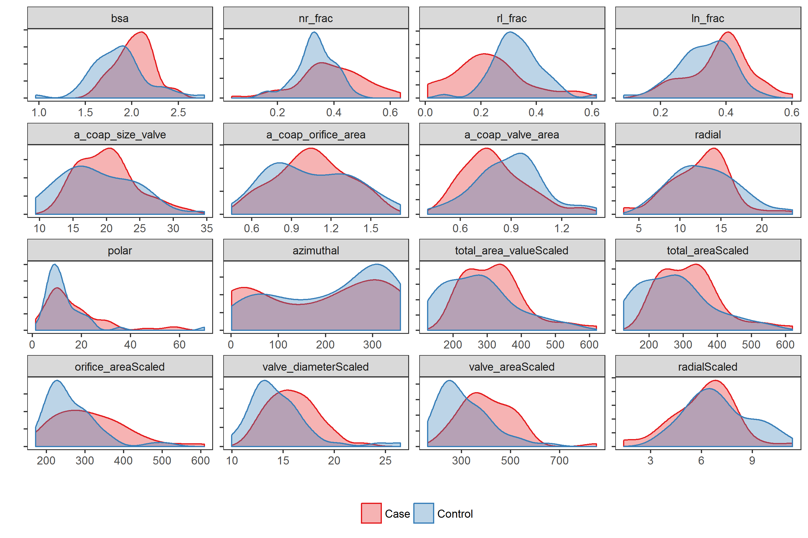

---

# Preamble

Set working directory.


```r
setwd("~/Projects/SilberbachPrintValve/scripts")
```

Load libraries.


```r
library(readxl)
library(magrittr)
library(dplyr)
```

```
## 
## Attaching package: 'dplyr'
```

```
## The following objects are masked from 'package:stats':
## 
##     filter, lag
```

```
## The following objects are masked from 'package:base':
## 
##     intersect, setdiff, setequal, union
```

```r
library(reshape2)
library(broom)
library(ggplot2)
library(knitr)
```

Reproducibility steps.


```r
sessionInfo() %>% print(locale = FALSE)
```

```
## R version 3.3.2 (2016-10-31)
## Platform: x86_64-w64-mingw32/x64 (64-bit)
## Running under: Windows 7 x64 (build 7601) Service Pack 1
## 
## attached base packages:
## [1] stats     graphics  grDevices utils     datasets  base     
## 
## other attached packages:
##  [1] ggplot2_2.2.1        broom_0.4.1          reshape2_1.4.2      
##  [4] dplyr_0.5.0          magrittr_1.5         readxl_0.1.1        
##  [7] rmarkdown_1.3        knitr_1.15.1         checkpoint_0.3.16   
## [10] RevoUtilsMath_10.0.0
## 
## loaded via a namespace (and not attached):
##  [1] Rcpp_0.12.8      munsell_0.4.3    mnormt_1.5-5     colorspace_1.3-2
##  [5] lattice_0.20-34  R6_2.2.0         stringr_1.1.0    plyr_1.8.4      
##  [9] tools_3.3.2      parallel_3.3.2   grid_3.3.2       gtable_0.2.0    
## [13] nlme_3.1-128     psych_1.6.9      DBI_0.5-1        htmltools_0.3.5 
## [17] lazyeval_0.2.0   rprojroot_1.1    digest_0.6.10    assertthat_0.1  
## [21] tibble_1.2       tidyr_0.6.0      evaluate_0.10    stringi_1.1.2   
## [25] scales_0.4.1     methods_3.3.2    RevoUtils_10.0.2 backports_1.0.4 
## [29] foreign_0.8-67
```

```r
"2017-01-25" %>% as.Date %>% as.integer %>% set.seed
```

Source user-defined functions.


```r
sapply(list.files("../lib", full.names = TRUE), source)
```

```
##         ../lib/cart2sph.R ../lib/compare.R ../lib/dist.R
## value   ?                 ?                ?            
## visible FALSE             FALSE            FALSE        
##         ../lib/normalize.R
## value   ?                 
## visible FALSE
```

---

# Read anonymized data

1. Read the Excel file
1. Rename columns
1. Remove patients with missing values for `nl`, `rl`, and `ln`
1. Remove extraneous columns
1. Scale size variables by body surface area, `bsa`
1. Fix sign of `centroidBottomZ`
1. Rotate the calculated centroid coordinates relative to "north", as defined by `nstar_X` and `nstar_Y`.
1. Convert cartesian coordinates of rotated coaptation line to spherical coordinates
  * See function [`cart2sph`](../lib/cart2sph.R)
  * $\rho$ = radial distance
  * $\theta$ = polar angle (inclination) bounded between [0, pi] or [0, 180]; default units is radians
  * $\phi$ = azimuthal angle bounded between [0, 2 * pi] or [0, 360]; default units is radians
  * $\rho, \theta, \phi$ will be used to describe the coaptation line

Example coaptation line (triple point) is below.


Link to interactive representation of the coaptation line is [here](https://ggbm.at/h6FyDngs).


```r
f <- file.path("C:/Users/chanb/Box Sync/PrintValveGroup AnonymyzedData",
               "Anonymyized.Consolidated Validated Spreadsheet, missing some BSAs.xlsx")
df <-
  read_excel(f, col_names = FALSE, skip = 1, na = "x") %>% 
  rename(id = X0,
         type = X1,
         randid = X2,
         studydate = X3,
         gender = X4,
         pmh = X5,
         ct_surgeries = X6,
         hx_stroke = X7,
         clinic_visit_date = X8,
         bp = X9,
         anti_htn_meds = X10,
         date_of_echo = X11,
         days_b_w_echo_cmr = X12,
         aov_velocity = X13,
         date_of_cmr = X14,
         aov_morphology = X15,
         diagnosis = X16,
         ar = X17,
         as = X18,
         lvedv = X19,
         lvedvi = X20,
         lvesv = X21,
         lvesvi = X22,
         ef = X23,
         ht = X24,
         wt = X25,
         bsa = X26,
         nr = X27,
         nr_frac = X28,
         rl = X29,
         rl_frac = X30,
         ln = X31,
         ln_frac = X32,
         total_area_value = X33,
         total_area = X34,
         orifice_area = X35,
         valve_diameter = X36,
         valve_area = X37,
         a_coap_size_valve = X38,
         a_coap_orifice_area = X39,
         a_coap_valve_area = X40,
         mimics_notes = X41,
         three_matic_notes = X42,
         type2 = X43,
         xybavtype = X44,
         xyaortopathY = X45,
         centroidCalcX = X46,
         centroidCalcY = X47,
         centroidGeoX = X48,
         centroidGeoY = X49,
         centroidBottomX = X50,
         centroidBottomY = X51,
         centroidBottomZ = X52,
         nstar_X = X53,
         nstar_Y = X54,
         coapt_line_length = X55) %>% 
  filter(!is.na(nr) & !is.na(rl) & !is.na(ln)) %>% 
  select(-matches("type2")) %>%
  mutate(centroidBottomZ = -abs(centroidBottomZ)) %>%
  mutate(dotProd =
           normalize(centroidCalcX, centroidCalcY) * normalize(nstar_X, nstar_Y) +
           normalize(centroidCalcY, centroidCalcX) * normalize(nstar_Y, nstar_X),
         rotation = acos(dotProd),  # Radians
         rotationDeg = rotation * (180 / pi),
         centroidCalcRotatedX = centroidCalcX * cos(rotation) - centroidCalcY * sin(rotation),
         centroidCalcRotatedY = centroidCalcX * sin(rotation) + centroidCalcY * cos(rotation),
         centroidBottomRotatedX = centroidBottomX * cos(rotation) - centroidBottomY * sin(rotation),
         centroidBottomRotatedY = centroidBottomX * sin(rotation) + centroidBottomY * cos(rotation)) %>% 
  bind_cols(cart2sph(.$centroidCalcRotatedX, .$centroidCalcRotatedY, 0,
                     .$centroidBottomRotatedX, .$centroidBottomRotatedY, .$centroidBottomZ,
                     units = "deg"))
```

Check calculation of `radial` against given `coapt_line_length`; it should be 1.0


```r
message(sprintf("Correlation between coapt_line_length and calculated radial is: %.05f",
                cor(df$coapt_line_length, df$radial, use = "complete.obs")))
```

```
## Correlation between coapt_line_length and calculated radial is: 1.00000
```

Check correlation between body surface area, `bsa`, and other size variables.


```r
df %>% 
  select(matches("bsa|area|diam|size|radial")) %>% 
  cor(use = "complete") %>% 
  data.frame %>%
  select(1)
```

```
##                            bsa
## bsa                 1.00000000
## total_area_value    0.43389171
## total_area          0.43383111
## orifice_area        0.38031511
## valve_diameter      0.43803167
## valve_area          0.41583626
## a_coap_size_valve   0.34264935
## a_coap_orifice_area 0.17441802
## a_coap_valve_area   0.03386608
## radial              0.29232196
```

Scale the size variables by `bsa`.


```r
df <- 
  df %>%
  mutate(total_area_valueScaled = total_area_value / bsa,
         total_areaScaled = total_area / bsa,
         orifice_areaScaled = orifice_area / bsa,
         valve_diameterScaled = valve_diameter / bsa,
         valve_areaScaled = valve_area / bsa,
         radialScaled = radial / bsa)
```

Output a subset for spot-checking.


```r
var <- "centroid[(Calc)|(Bottom)]|nstar|rotation|coapt|radial|polar|azimuthal"
df %>%
  sample_n(5) %>%
  select(matches(var)) %>% 
  write.csv(file = "../data/processed/sphericalCoordinates.csv",
            row.names = FALSE,
            na = "")
```

Summarize the entire data set.


```r
df %>% group_by(type) %>% tally %>% kable
```


|type    |  n|
|:-------|--:|
|Case    | 48|
|Control | 49|

```r
summary(df)
```

```
##        id             type              randid         
##  Min.   :  2.00   Length:97          Length:97         
##  1st Qu.: 26.00   Class :character   Class :character  
##  Median : 50.00   Mode  :character   Mode  :character  
##  Mean   : 50.29                                        
##  3rd Qu.: 75.00                                        
##  Max.   :100.00                                        
##                                                        
##    studydate                      gender              pmh           
##  Min.   :2013-01-04 00:00:00   Length:97          Length:97         
##  1st Qu.:2015-06-12 00:00:00   Class :character   Class :character  
##  Median :2015-12-23 00:00:00   Mode  :character   Mode  :character  
##  Mean   :2015-09-28 12:37:06                                        
##  3rd Qu.:2016-03-11 00:00:00                                        
##  Max.   :2016-07-22 00:00:00                                        
##                                                                     
##  ct_surgeries        hx_stroke         clinic_visit_date            
##  Length:97          Length:97          Min.   :2008-08-20 00:00:00  
##  Class :character   Class :character   1st Qu.:2011-04-19 00:00:00  
##  Mode  :character   Mode  :character   Median :2011-11-10 00:00:00  
##                                        Mean   :2011-08-18 23:00:37  
##                                        3rd Qu.:2012-03-10 00:00:00  
##                                        Max.   :2012-08-09 00:00:00  
##                                                                     
##       bp            anti_htn_meds      date_of_echo      
##  Length:97          Length:97          Length:97         
##  Class :character   Class :character   Class :character  
##  Mode  :character   Mode  :character   Mode  :character  
##                                                          
##                                                          
##                                                          
##                                                          
##  days_b_w_echo_cmr aov_velocity        date_of_cmr                 
##  Min.   :-599.00   Length:97          Min.   :2009-01-03 00:00:00  
##  1st Qu.:  32.75   Class :character   1st Qu.:2011-06-11 00:00:00  
##  Median : 104.50   Mode  :character   Median :2011-12-22 00:00:00  
##  Mean   : 215.62                      Mean   :2011-09-27 12:07:25  
##  3rd Qu.: 364.50                      3rd Qu.:2012-03-10 00:00:00  
##  Max.   :1849.00                      Max.   :2012-07-21 00:00:00  
##  NA's   :7                                                         
##  aov_morphology      diagnosis              ar           
##  Length:97          Length:97          Length:97         
##  Class :character   Class :character   Class :character  
##  Mode  :character   Mode  :character   Mode  :character  
##                                                          
##                                                          
##                                                          
##                                                          
##       as                lvedv           lvedvi           lvesv       
##  Length:97          Min.   : 69.0   Min.   :  0.00   Min.   : 17.00  
##  Class :character   1st Qu.:119.8   1st Qu.: 58.51   1st Qu.: 41.00  
##  Mode  :character   Median :149.5   Median : 74.53   Median : 52.00  
##                     Mean   :162.8   Mean   : 69.42   Mean   : 59.05  
##                     3rd Qu.:181.8   3rd Qu.: 88.01   3rd Qu.: 69.00  
##                     Max.   :405.0   Max.   :202.07   Max.   :249.00  
##                     NA's   :17                       NA's   :17      
##      lvesvi             ef              ht              wt        
##  Min.   :  0.00   Min.   :23.00   Min.   : 65.0   Min.   : 46.00  
##  1st Qu.: 19.18   1st Qu.:60.75   1st Qu.:165.0   1st Qu.: 68.18  
##  Median : 24.48   Median :65.00   Median :175.0   Median : 78.64  
##  Mean   : 25.17   Mean   :64.58   Mean   :173.1   Mean   : 81.52  
##  3rd Qu.: 34.13   3rd Qu.:70.00   3rd Qu.:182.9   3rd Qu.: 91.82  
##  Max.   :130.00   Max.   :77.00   Max.   :206.0   Max.   :178.00  
##                   NA's   :17                                      
##       bsa              nr           nr_frac              rl       
##  Min.   :0.964   Min.   : 24.0   Min.   :0.03681   Min.   :  5.0  
##  1st Qu.:1.755   1st Qu.:132.0   1st Qu.:0.31496   1st Qu.: 91.0  
##  Median :1.950   Median :198.0   Median :0.34817   Median :148.0  
##  Mean   :1.945   Mean   :209.6   Mean   :0.36249   Mean   :161.8  
##  3rd Qu.:2.128   3rd Qu.:282.0   3rd Qu.:0.42606   3rd Qu.:206.0  
##  Max.   :2.782   Max.   :426.0   Max.   :0.63658   Max.   :483.0  
##                                                                   
##     rl_frac               ln           ln_frac       total_area_value
##  Min.   :0.009074   Min.   : 33.0   Min.   :0.0880   Min.   : 206.0  
##  1st Qu.:0.206128   1st Qu.:138.0   1st Qu.:0.2961   1st Qu.: 424.0  
##  Median :0.286957   Median :194.0   Median :0.3758   Median : 551.0  
##  Mean   :0.280088   Mean   :209.9   Mean   :0.3574   Mean   : 581.2  
##  3rd Qu.:0.354319   3rd Qu.:268.0   3rd Qu.:0.4114   3rd Qu.: 697.0  
##  Max.   :0.616000   Max.   :596.0   Max.   :0.6023   Max.   :1171.0  
##                                                                      
##    total_area      orifice_area  valve_diameter    valve_area    
##  Min.   : 206.8   Min.   : 299   Min.   :18.48   Min.   : 268.2  
##  1st Qu.: 424.6   1st Qu.: 433   1st Qu.:25.32   1st Qu.: 503.5  
##  Median : 551.6   Median : 528   Median :29.13   Median : 666.5  
##  Mean   : 581.9   Mean   : 561   Mean   :29.36   Mean   : 698.9  
##  3rd Qu.: 697.7   3rd Qu.: 646   3rd Qu.:33.16   3rd Qu.: 863.6  
##  Max.   :1171.5   Max.   :1221   Max.   :47.26   Max.   :1754.2  
##                                                                  
##  a_coap_size_valve a_coap_orifice_area a_coap_valve_area
##  Min.   : 9.409    Min.   :0.4486      Min.   :0.4068   
##  1st Qu.:15.772    1st Qu.:0.8223      1st Qu.:0.7168   
##  Median :19.302    Median :1.0534      Median :0.8200   
##  Mean   :19.406    Mean   :1.0526      Mean   :0.8502   
##  3rd Qu.:22.265    3rd Qu.:1.2768      3rd Qu.:0.9832   
##  Max.   :34.659    Max.   :1.7247      Max.   :1.4054   
##                                                         
##  mimics_notes       three_matic_notes   xybavtype        
##  Length:97          Length:97          Length:97         
##  Class :character   Class :character   Class :character  
##  Mode  :character   Mode  :character   Mode  :character  
##                                                          
##                                                          
##                                                          
##                                                          
##  xyaortopathY       centroidCalcX     centroidCalcY      centroidGeoX    
##  Length:97          Min.   :-0.1146   Min.   :-0.3838   Min.   :-0.3523  
##  Class :character   1st Qu.:10.0919   1st Qu.: 5.3056   1st Qu.:10.3557  
##  Mode  :character   Median :12.6341   Median : 6.5029   Median :12.2555  
##                     Mean   :13.3072   Mean   : 6.4127   Mean   :12.1784  
##                     3rd Qu.:16.0805   3rd Qu.: 7.8053   3rd Qu.:14.1252  
##                     Max.   :28.5256   Max.   :13.8873   Max.   :19.2920  
##                                                                          
##   centroidGeoY    centroidBottomX   centroidBottomY  centroidBottomZ  
##  Min.   :-1.025   Min.   :-0.5196   Min.   :-2.484   Min.   :-22.005  
##  1st Qu.: 5.992   1st Qu.:10.4865   1st Qu.: 4.087   1st Qu.:-14.528  
##  Median : 7.595   Median :13.3550   Median : 5.411   Median :-12.068  
##  Mean   : 7.402   Mean   :13.9806   Mean   : 5.589   Mean   :-12.188  
##  3rd Qu.: 8.802   3rd Qu.:16.8814   3rd Qu.: 7.240   3rd Qu.: -9.503  
##  Max.   :13.648   Max.   :29.6287   Max.   :16.205   Max.   : -1.912  
##                                                                       
##     nstar_X          nstar_Y       coapt_line_length    dotProd       
##  Min.   :-1.496   Min.   : 0.000   Min.   : 3.129    Min.   :-0.9867  
##  1st Qu.: 5.436   1st Qu.: 9.046   1st Qu.: 9.986    1st Qu.: 0.8208  
##  Median : 6.874   Median :11.118   Median :12.992    Median : 0.8637  
##  Mean   : 7.347   Mean   :10.721   Mean   :12.711    Mean   : 0.8402  
##  3rd Qu.: 8.778   3rd Qu.:12.361   3rd Qu.:14.761    3rd Qu.: 0.9055  
##  Max.   :19.944   Max.   :18.536   Max.   :23.724    Max.   : 1.0000  
##                                                                       
##     rotation       rotationDeg     centroidCalcRotatedX
##  Min.   :0.0000   Min.   :  0.00   Min.   :-0.5603     
##  1st Qu.:0.4382   1st Qu.: 25.11   1st Qu.: 6.0750     
##  Median :0.5282   Median : 30.26   Median : 7.9637     
##  Mean   :0.5332   Mean   : 30.55   Mean   : 8.3269     
##  3rd Qu.:0.6079   3rd Qu.: 34.83   3rd Qu.:10.0757     
##  Max.   :2.9782   Max.   :170.64   Max.   :19.9717     
##                                                        
##  centroidCalcRotatedY centroidBottomRotatedX centroidBottomRotatedY
##  Min.   : 0.00        Min.   : 0.2473        Min.   : 2.021        
##  1st Qu.:10.04        1st Qu.: 6.4550        1st Qu.: 9.282        
##  Median :12.48        Median : 8.3093        Median :11.809        
##  Mean   :12.31        Mean   : 9.3163        Mean   :11.917        
##  3rd Qu.:14.86        3rd Qu.:11.6956        3rd Qu.:14.515        
##  Max.   :20.77        Max.   :22.0511        Max.   :21.158        
##                                                                    
##      radial           polar          azimuthal      
##  Min.   : 3.129   Min.   : 1.280   Min.   :  1.212  
##  1st Qu.: 9.986   1st Qu.: 8.237   1st Qu.: 69.724  
##  Median :12.992   Median :11.328   Median :237.089  
##  Mean   :12.711   Mean   :14.843   Mean   :198.201  
##  3rd Qu.:14.761   3rd Qu.:18.406   3rd Qu.:315.037  
##  Max.   :23.724   Max.   :70.144   Max.   :358.824  
##                                                     
##  total_area_valueScaled total_areaScaled orifice_areaScaled
##  Min.   :125.0          Min.   :125.3    Min.   :172.2     
##  1st Qu.:221.0          1st Qu.:221.3    1st Qu.:225.5     
##  Median :288.9          Median :289.3    Median :272.3     
##  Mean   :297.8          Mean   :298.1    Mean   :289.3     
##  3rd Qu.:352.6          3rd Qu.:352.9    3rd Qu.:331.1     
##  Max.   :620.6          Max.   :620.9    Max.   :609.2     
##                                                            
##  valve_diameterScaled valve_areaScaled  radialScaled   
##  Min.   : 9.971       Min.   :162.0    Min.   : 1.406  
##  1st Qu.:13.236       1st Qu.:263.9    1st Qu.: 5.431  
##  Median :15.050       Median :346.9    Median : 6.721  
##  Mean   :15.250       Mean   :359.1    Mean   : 6.584  
##  3rd Qu.:16.822       3rd Qu.:424.4    3rd Qu.: 7.567  
##  Max.   :26.462       Max.   :850.4    Max.   :11.371  
## 
```

---

# Compare cases and controls

The case-control variable is `type`.


```r
results <- rbind(compare("bsa", "Body surface area"),
                 compare("nr_frac", "NR fraction"),
                 compare("rl_frac", "RL fraction"),
                 compare("ln_frac", "LN fraction"),
                 compare("total_area_value", "Total coaptation area, value"),
                 compare("total_area", "Total coaptation area, calculated"),
                 compare("orifice_area", "Orifice area"),
                 compare("valve_diameter", "Valve diameter"),
                 compare("valve_area", "Valve area"),
                 compare("a_coap_size_valve", "Total valve coaptation area relative to valve diameter"),
                 compare("a_coap_orifice_area", "Total valve coaptation area relative to orifice area"),
                 compare("a_coap_valve_area", "Total valve coaptation area relative to valve area"),
                 compare("coapt_line_length", "Coaptation line length"),
                 compare("radial", "Coaptation line length"),
                 compare("polar", "Polar angle of coaptation line (top to bottom"),
                 compare("azimuthal", "Azimuthal angle of coaptation line"),
                 compare("total_area_valueScaled", "Total coaptation area, value, scaled to BSA"),
                 compare("total_areaScaled", "Total coaptation area, calculated, scaled to BSA"),
                 compare("orifice_areaScaled", "Orifice area scaled to BSA"),
                 compare("valve_diameterScaled", "Valve diameter scaled to BSA"),
                 compare("valve_areaScaled", "Valve area scaled to BSA"),
                 compare("radialScaled", "Coaptation line length scaled to BSA"))
```

Plot comparisons.

Images are saved as [PNG](../figures/histograms-1.png) and [SVG](../figures/histograms.svg) files.


```r
var <- "^id|^type|radial|polar|azimuthal|Scaled|frac|a_coap|bsa"
df1 <-
  df %>%
  select(matches(var)) %>%
  melt(id.vars = c("id", "type")) %>% 
  mutate(type = factor(type))
levels(df1$variable)
```

```
##  [1] "bsa"                    "nr_frac"               
##  [3] "rl_frac"                "ln_frac"               
##  [5] "a_coap_size_valve"      "a_coap_orifice_area"   
##  [7] "a_coap_valve_area"      "radial"                
##  [9] "polar"                  "azimuthal"             
## [11] "total_area_valueScaled" "total_areaScaled"      
## [13] "orifice_areaScaled"     "valve_diameterScaled"  
## [15] "valve_areaScaled"       "radialScaled"
```

```r
g <-
  df1 %>% 
  ggplot +
    aes(x = value, color = type, fill = type) +
    geom_density(alpha = 1/3) +
    scale_x_continuous("") +
    scale_y_continuous("", labels = NULL) +
    scale_color_brewer("", palette = "Set1") +
    scale_fill_brewer("", palette = "Set1") +
    facet_wrap(~ variable, ncol = 4, scales = "free") +
    theme_bw() +
    theme(legend.position = "bottom",
          panel.grid = element_blank())
g
```



```r
ggsave("../figures/histograms.svg", dpi = 300, height = 6, width = 9, units = "in")
```

Adjust p-values for multiple comparisons.


```r
results <-
  results %>%
  mutate(pAdjust = p.adjust(pValue, method = "BH"),
         sig = pAdjust < 0.05)
```

Output results.


```r
results %>% kable
```


|variable                                               | nCases|meanSDCases       |rangeCases          | nControls|meanSDControls    |rangeControls       |  difference|     seDiff| tStatistic|    pValue|   pAdjust|sig   |
|:------------------------------------------------------|------:|:-----------------|:-------------------|---------:|:-----------------|:-------------------|-----------:|----------:|----------:|---------:|---------:|:-----|
|Body surface area                                      |     48|2.026 (0.202)     |(1.572, 2.497)      |        49|1.866 (0.313)     |(0.964, 2.782)      |   0.1601531|  0.0536110|  2.9873184| 0.0035808| 0.0087532|TRUE  |
|NR fraction                                            |     48|0.391 (0.120)     |(0.037, 0.637)      |        49|0.335 (0.068)     |(0.157, 0.481)      |   0.0560878|  0.0197899|  2.8341556| 0.0056126| 0.0123477|TRUE  |
|RL fraction                                            |     48|0.228 (0.133)     |(0.009, 0.559)      |        49|0.331 (0.091)     |(0.067, 0.616)      |  -0.1029746|  0.0230101| -4.4751853| 0.0000212| 0.0001166|TRUE  |
|LN fraction                                            |     48|0.381 (0.094)     |(0.152, 0.602)      |        49|0.334 (0.081)     |(0.088, 0.504)      |   0.0468868|  0.0178691|  2.6239108| 0.0101284| 0.0202568|TRUE  |
|Total coaptation area, value                           |     48|648.704 (189.488) |(398.000, 1171.000) |        49|515.095 (224.243) |(206.000, 1087.660) | 133.6092730| 42.1952467|  3.1664532| 0.0020747| 0.0065423|TRUE  |
|Total coaptation area, calculated                      |     48|649.323 (189.494) |(398.560, 1171.491) |        49|515.761 (224.234) |(206.820, 1088.279) | 133.5623861| 42.1947005|  3.1653830| 0.0020816| 0.0065423|TRUE  |
|Orifice area                                           |     48|636.750 (196.511) |(341.000, 1221.000) |        49|486.755 (119.977) |(299.000, 812.000)  | 149.9948980| 32.9828869|  4.5476583| 0.0000160| 0.0001166|TRUE  |
|Valve diameter                                         |     48|32.110 (4.487)    |(22.450, 47.260)    |        49|26.676 (4.594)    |(18.480, 36.680)    |   5.4336692|  0.9223465|  5.8911368| 0.0000001| 0.0000013|TRUE  |
|Valve area                                             |     48|825.262 (234.532) |(395.843, 1754.193) |        49|575.142 (199.141) |(268.222, 1056.692) | 250.1206244| 44.1437443|  5.6660491| 0.0000002| 0.0000017|TRUE  |
|Total valve coaptation area relative to valve diameter |     48|20.084 (4.365)    |(12.528, 32.113)    |        49|18.743 (5.574)    |(9.409, 34.659)     |   1.3406005|  1.0179301|  1.3169868| 0.1910110| 0.2334579|FALSE |
|Total valve coaptation area relative to orifice area   |     48|1.059 (0.266)     |(0.559, 1.577)      |        49|1.047 (0.321)     |(0.449, 1.725)      |   0.0121495|  0.0599023|  0.2028216| 0.8397082| 0.8397082|FALSE |
|Total valve coaptation area relative to valve area     |     48|0.807 (0.191)     |(0.471, 1.338)      |        49|0.893 (0.203)     |(0.407, 1.405)      |  -0.0855492|  0.0400184| -2.1377445| 0.0351042| 0.0482683|TRUE  |
|Coaptation line length                                 |     48|12.380 (3.753)    |(3.129, 22.951)     |        49|13.036 (4.003)    |(5.630, 23.724)     |  -0.6562349|  0.7882625| -0.8325081| 0.4072102| 0.4266011|FALSE |
|Coaptation line length                                 |     48|12.380 (3.753)    |(3.129, 22.951)     |        49|13.036 (4.003)    |(5.630, 23.724)     |  -0.6562349|  0.7882625| -0.8325081| 0.4072102| 0.4266011|FALSE |
|Polar angle of coaptation line (top to bottom          |     48|16.582 (12.494)   |(1.280, 59.152)     |        49|13.139 (10.433)   |(1.492, 70.144)     |   3.4429561|  2.3351759|  1.4743883| 0.1436833| 0.1859431|FALSE |
|Azimuthal angle of coaptation line                     |     48|184.684 (133.204) |(1.212, 358.824)    |        49|211.443 (116.612) |(12.159, 349.432)   | -26.7591262| 25.4045403| -1.0533206| 0.2948658| 0.3414235|FALSE |
|Total coaptation area, value, scaled to BSA            |     48|321.319 (92.858)  |(195.738, 620.607)  |        49|274.736 (105.037) |(124.973, 551.560)  |  46.5833539| 20.1452572|  2.3123733| 0.0229165| 0.0362975|TRUE  |
|Total coaptation area, calculated, scaled to BSA       |     48|321.627 (92.861)  |(195.953, 620.867)  |        49|275.106 (105.038) |(125.265, 551.874)  |  46.5206094| 20.1456177|  2.3092173| 0.0230984| 0.0362975|TRUE  |
|Orifice area scaled to BSA                             |     48|314.830 (92.726)  |(184.753, 609.195)  |        49|264.295 (67.815)  |(172.187, 515.540)  |  50.5358867| 16.4700818|  3.0683446| 0.0028050| 0.0077137|TRUE  |
|Valve diameter scaled to BSA                           |     48|15.948 (2.400)    |(11.706, 22.911)    |        49|14.565 (3.087)    |(9.971, 26.462)     |   1.3831110|  0.5621724|  2.4602967| 0.0156890| 0.0287632|TRUE  |
|Valve area scaled to BSA                               |     48|408.528 (114.056) |(218.166, 850.409)  |        49|310.615 (105.079) |(162.031, 652.612)  |  97.9128805| 22.2601003|  4.3985822| 0.0000284| 0.0001252|TRUE  |
|Coaptation line length scaled to BSA                   |     48|6.150 (1.857)     |(1.406, 11.371)     |        49|7.010 (1.908)     |(3.379, 11.130)     |  -0.8605225|  0.3824488| -2.2500332| 0.0267545| 0.0392400|TRUE  |

```r
results %>% write.csv(file = "../data/processed/compare.csv",
                      row.names = FALSE,
                      na = "")
```
