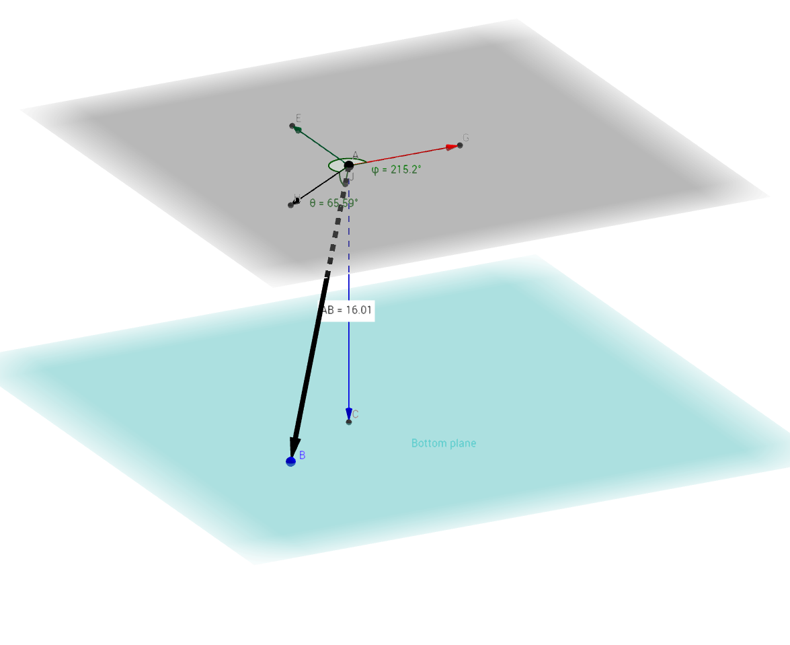
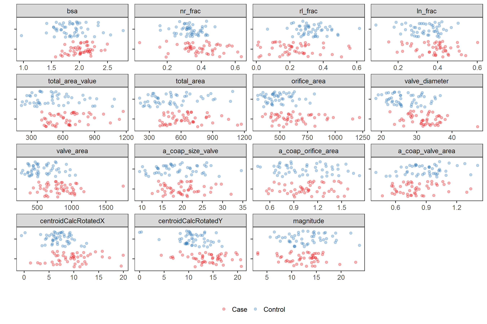
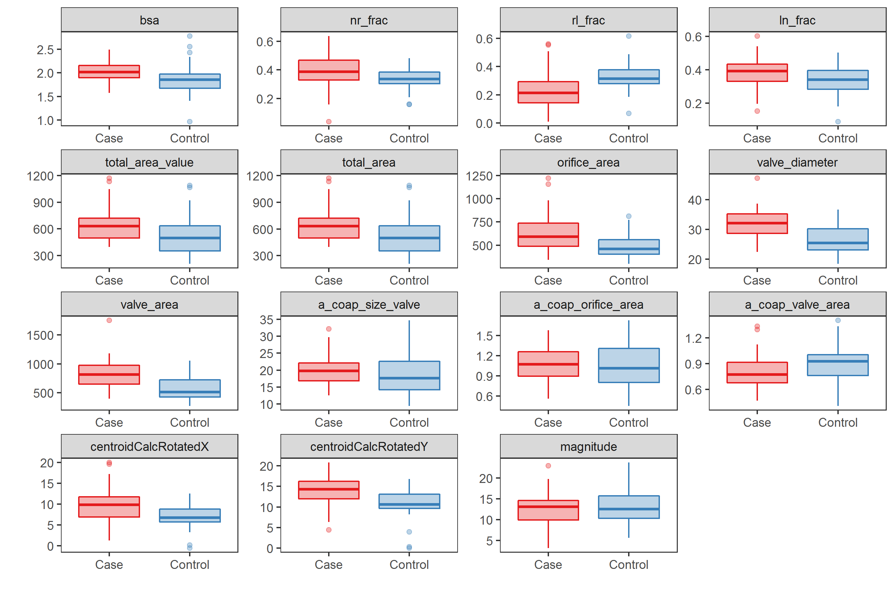
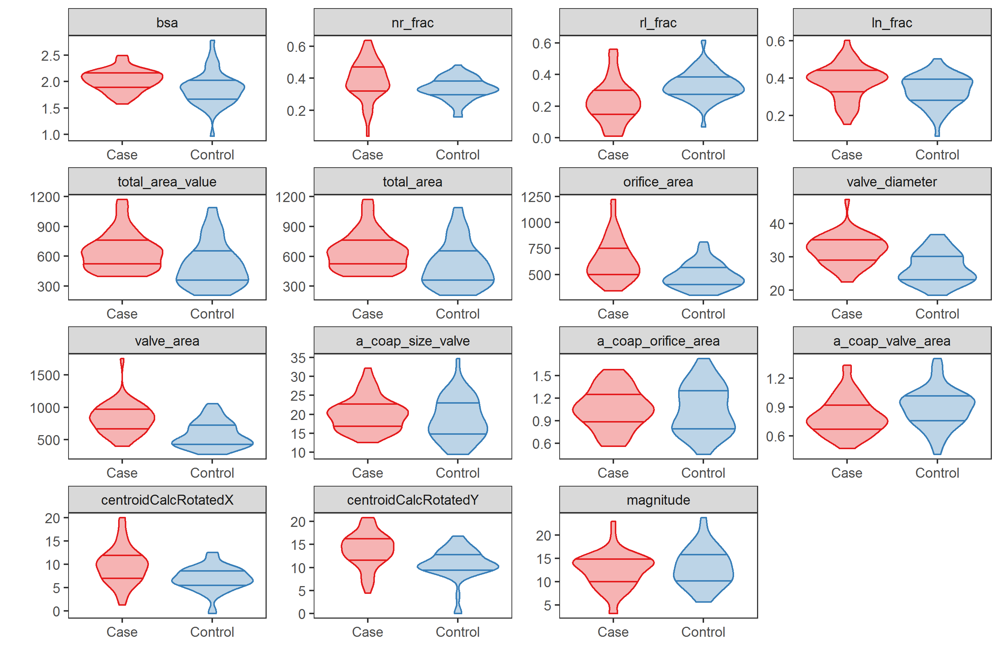

# Read anonymized data

Read and clean data.
R code is suppressed for brevity.
See [`read.Rmd`](../scripts/read.Rmd) for full details.

1. Read the Excel file
1. Rename columns
1. Remove patients with missing values for `nl`, `rl`, and `ln`
  * 2 cases, 1 control
1. Remove extraneous columns
1. Add logical indicator for `type` *Case*
1. Fix sign of `centroidBottomZ`
  * All values should be $<0$; a few were $>0$
1. Rotate the calculated centroid coordinates relative to "north", as defined by `nstar_X` and `nstar_Y`.
  * Rotate both the calculated and bottom centroids
1. Convert cartesian coordinates of rotated coaptation line to spherical coordinates
  * See function [`cart2sph`](../lib/cart2sph.R)
  * $\rho$ = radial distance
  * $\theta$ = latitude (i.e., polar angle or inclination) bounded between $(0, \pi)$ or $(0^{\circ}, 180^{\circ})$; default units is radians
  * $\phi$ = langitude (i.e., azimuthal angle or direction) bounded between $(-\pi, \pi)$ or $(-180^{\circ}, +180^{\circ})$; default units is radians
  * $\rho, \theta, \phi$ will be used to describe the coaptation line
1. Shift cartesian coordinates of the coaptation line to start at (0, 0, 0)
1. Normalize the orientation of the coaptation line to the unit sphere
1. Scale body size measures, `bsa` and `orifice_area`, to have mean = 0 and SD = 1
1. Lump categories of aortic stenosis, `as`, and aortic regurgitation (insufficiency), `ar`

Example coaptation line (triple point) is below.
An interactive representation of the coaptation line geometry is [here](https://ggbm.at/CeF95YMN).




Check calculation of `magnitude` against given `coapt_line_length`; it should be 1.0


```
## Correlation between coapt_line_length and calculated magnitude is: 1.00000
```

Check correlation between body surface area, `bsa`, and other size variables.


|                    |       bsa|
|:-------------------|---------:|
|bsa                 | 1.0000000|
|total_area_value    | 0.4338917|
|total_area          | 0.4338311|
|orifice_area        | 0.3803151|
|valve_diameter      | 0.4380317|
|valve_area          | 0.4158363|
|a_coap_size_valve   | 0.3426494|
|a_coap_orifice_area | 0.1744180|
|a_coap_valve_area   | 0.0338661|
|magnitude           | 0.2923220|
|bsaScaled           | 1.0000000|
|orificeAreaScaled   | 0.3803151|
|magnitudeScaled     | 0.2923220|

Output a subset for spot-checking.


```
## File ../data/processed/sphericalCoordinates.csv was written on 2017-03-13 10:11:13
```

Summarize the entire data set.


|type    |  n|
|:-------|--:|
|Case    | 48|
|Control | 49|
# Compare cases and controls

The case-control variable is `type`.

Plot comparisons.
Use multiple visualizations, density plots and scatterplots.
Each has their advantages and disadvantages.

## Density plots

[PNG](../figures/densityplots.png), [SVG](../figures/densityplots.svg)


## Scatterplots

[PNG](../figures/scatterplots.png), [SVG](../figures/scatterplots.svg)




## Boxplots

[PNG](../figures/boxplots.png), [SVG](../figures/boxplots.svg)




## Violin plots

[PNG](../figures/violinplots.png), [SVG](../figures/violinplots.svg)




## Unadjusted/unscaled comparisons

Calculate mean (SD) and ranges.
Calculate differences in means.
Adjust p-values for multiple comparisons.


Output results.
Results save as [CSV](../data/processed/compareUnadjusted.csv).


|variable                                               |meanSDCases    |meanSDControls | difference|
|:------------------------------------------------------|:--------------|:--------------|----------:|
|Body surface area                                      |2.03 (0.202)   |1.87 (0.313)   |     0.1600|
|NR fraction                                            |0.391 (0.12)   |0.335 (0.0682) |     0.0561|
|RL fraction                                            |0.228 (0.133)  |0.331 (0.0906) |    -0.1030|
|LN fraction                                            |0.381 (0.0945) |0.334 (0.0812) |     0.0469|
|Total coaptation area, value                           |649 (189)      |515 (224)      |   134.0000|
|Total coaptation area, calculated                      |649 (189)      |516 (224)      |   134.0000|
|Orifice area                                           |637 (197)      |487 (120)      |   150.0000|
|Valve diameter                                         |32.1 (4.49)    |26.7 (4.59)    |     5.4300|
|Valve area                                             |825 (235)      |575 (199)      |   250.0000|
|Total valve coaptation area relative to valve diameter |20.1 (4.37)    |18.7 (5.57)    |     1.3400|
|Total valve coaptation area relative to orifice area   |1.06 (0.266)   |1.05 (0.321)   |     0.0121|
|Total valve coaptation area relative to valve area     |0.807 (0.191)  |0.893 (0.203)  |    -0.0855|
|Coaptation line length                                 |12.4 (3.75)    |13 (4)         |    -0.6560|
|Ceiling centroid point X-coordinate                    |9.73 (3.96)    |6.96 (2.55)    |     2.7700|
|Ceiling centroid point Y-coordinate                    |13.8 (3.72)    |10.8 (3.25)    |     3.0100|

```
## File ../data/processed/compareUnadjusted.csv was written on 2017-03-13 10:11:51
```

## Adjusted comparisons

Adjusted for **orifice area.**

Calculate mean (SD) and ranges.
Calculate differences in means.
Adjust p-values for multiple comparisons.


Output results.
Results save as [CSV](../data/processed/compareAdjusted.csv).


|variable                                               | difference|  seDiff|  pAdjust|sig   |
|:------------------------------------------------------|----------:|-------:|--------:|:-----|
|Body surface area                                      |     0.0880|  0.0568| 0.175000|FALSE |
|NR fraction                                            |     0.0595|  0.0219| 0.015900|TRUE  |
|RL fraction                                            |    -0.1110|  0.0255| 0.000493|TRUE  |
|LN fraction                                            |     0.0511|  0.0198| 0.018800|TRUE  |
|Total coaptation area, value                           |    24.2000| 38.4000| 0.532000|FALSE |
|Total coaptation area, calculated                      |    24.1000| 38.4000| 0.532000|FALSE |
|Valve diameter                                         |     3.2600|  0.8740| 0.002350|TRUE  |
|Valve area                                             |   147.0000| 42.0000| 0.003350|TRUE  |
|Total valve coaptation area relative to valve diameter |    -0.7950|  1.0000| 0.501000|FALSE |
|Total valve coaptation area relative to orifice area   |     0.0651|  0.0652| 0.408000|FALSE |
|Total valve coaptation area relative to valve area     |    -0.1120|  0.0439| 0.018800|TRUE  |
|Coaptation line length                                 |    -2.2100|  0.7880| 0.015900|TRUE  |
|Ceiling centroid point X-coordinate                    |     1.9700|  0.7230| 0.015900|TRUE  |
|Ceiling centroid point Y-coordinate                    |     2.1000|  0.7550| 0.015900|TRUE  |

```
## File ../data/processed/compareAdjusted.csv was written on 2017-03-13 10:11:51
```
# 3D plot

[Interactive HTML](../figures/webGL/sphereplot.html)


# Linear model of coaptation line length

## Unadjusted

Summary from linear model estimating coaptation line length by case or control group status,
**unadjusted.**

* Model statistics
* ANOVA table
* Predicted values, and confidence and prediction intervals


| r.squared| adj.r.squared| sigma| statistic| p.value| df|   logLik|     AIC|     BIC| deviance| df.residual|
|---------:|-------------:|-----:|---------:|-------:|--:|--------:|-------:|-------:|--------:|-----------:|
|     0.007|        -0.003| 3.882|     0.693|   0.407|  2| -268.181| 542.362| 550.086| 1431.301|          95|


|term        | estimate| std.error| statistic| p.value|
|:-----------|--------:|---------:|---------:|-------:|
|(Intercept) |    12.38|      0.56|     22.10|  0.0000|
|typeControl |     0.66|      0.79|      0.83|  0.4072|


|type    |   fit| lowerConf| upperConf| lowerPred| upperPred|
|:-------|-----:|---------:|---------:|---------:|---------:|
|Case    | 12.38|     11.27|     13.49|      4.59|     20.17|
|Control | 13.04|     11.93|     14.14|      5.25|     20.82|

**Interpretation**
Coaptation line length in the control population is, on average,
0.66 mm longer 
(95% CI: 
-0.89, 
2.2;
p-value:
0.4072)
than in the case population,
unadjusted.


## Adjusted for body surface area

Summary from linear model estimating coaptation line length by case or control group status,
**adjusted for body surface area.**

* Model statistics
* ANOVA table
* Predicted values, and confidence and prediction intervals


| r.squared| adj.r.squared| sigma| statistic| p.value| df|   logLik|     AIC|     BIC| deviance| df.residual|
|---------:|-------------:|-----:|---------:|-------:|--:|--------:|-------:|-------:|--------:|-----------:|
|     0.117|         0.099| 3.679|     6.249|   0.003|  3| -262.479| 532.959| 543.258| 1272.551|          94|


|term        | estimate| std.error| statistic| p.value|
|:-----------|--------:|---------:|---------:|-------:|
|(Intercept) |    11.98|      0.54|     22.05|  0.0000|
|typeControl |     1.44|      0.78|      1.84|  0.0685|
|bsaScaled   |     1.34|      0.39|      3.42|  0.0009|


|type    | bsaScaled|scaling             |   fit| lowerConf| upperConf| lowerPred| upperPred|
|:-------|---------:|:-------------------|-----:|---------:|---------:|---------:|---------:|
|Case    |        -1|-1 SD from mean BSA | 10.64|      9.18|     12.10|      3.19|     18.09|
|Case    |         0|Mean BSA            | 11.98|     10.90|     13.06|      4.60|     19.37|
|Case    |         1|+1 SD from mean BSA | 13.33|     12.14|     14.52|      5.93|     20.73|
|Control |        -1|-1 SD from mean BSA | 12.08|     10.90|     13.26|      4.68|     19.48|
|Control |         0|Mean BSA            | 13.42|     12.36|     14.49|      6.04|     20.81|
|Control |         1|+1 SD from mean BSA | 14.77|     13.32|     16.22|      7.32|     22.22|

**Interpretation**
Coaptation line length in the control population is, on average,
1.44 mm longer 
(95% CI: 
-0.09, 
2.97;
p-value:
0.0685)
than in the case population,
adjusted for body surface area.


## Adjusted for orifice area

Summary from linear model estimating coaptation line length by case or control group status,
**adjusted for orifice area.**

* Model statistics
* ANOVA table
* Predicted values, and confidence and prediction intervals


| r.squared| adj.r.squared| sigma| statistic| p.value| df|   logLik|     AIC|     BIC| deviance| df.residual|
|---------:|-------------:|-----:|---------:|-------:|--:|--------:|-------:|-------:|--------:|-----------:|
|     0.194|         0.177| 3.515|    11.343|       0|  3| -258.048| 524.097| 534.396| 1161.443|          94|


|term              | estimate| std.error| statistic| p.value|
|:-----------------|--------:|---------:|---------:|-------:|
|(Intercept)       |    11.59|      0.53|     21.69|   0.000|
|typeControl       |     2.21|      0.79|      2.81|   0.006|
|orificeAreaScaled |     1.85|      0.40|      4.67|   0.000|


|type    | orificeAreaScaled|scaling                      |   fit| lowerConf| upperConf| lowerPred| upperPred|
|:-------|-----------------:|:----------------------------|-----:|---------:|---------:|---------:|---------:|
|Case    |                -1|-1 SD from mean orifice area |  9.74|      8.24|     11.25|      2.60|     16.88|
|Case    |                 0|Mean orifice area            | 11.59|     10.53|     12.65|      4.53|     18.65|
|Case    |                 1|+1 SD from mean orifice area | 13.44|     12.34|     14.55|      6.38|     20.51|
|Control |                -1|-1 SD from mean orifice area | 11.96|     10.86|     13.05|      4.89|     19.02|
|Control |                 0|Mean orifice area            | 13.81|     12.76|     14.86|      6.75|     20.86|
|Control |                 1|+1 SD from mean orifice area | 15.66|     14.16|     17.15|      8.52|     22.79|

**Interpretation**
Coaptation line length in the control population is, on average,
2.21 mm longer 
(95% CI: 
0.67, 
3.76;
p-value:
0.006)
than in the case population,
adjusted for orifice area.
# Directional analysis of coaptation line

Citation for package `Directional`.


```
## 
## To cite package 'Directional' in publications use:
## 
##   Michail Tsagris, Giorgos Athineou and Anamul Sajib (2016).
##   Directional: Directional Statistics. R package version 2.3.
##   https://CRAN.R-project.org/package=Directional
## 
## A BibTeX entry for LaTeX users is
## 
##   @Manual{,
##     title = {Directional: Directional Statistics},
##     author = {Michail Tsagris and Giorgos Athineou and Anamul Sajib},
##     year = {2016},
##     note = {R package version 2.3},
##     url = {https://CRAN.R-project.org/package=Directional},
##   }
## 
## ATTENTION: This citation information has been auto-generated from
## the package DESCRIPTION file and may need manual editing, see
## 'help("citation")'.
```


## Plots

Spherical coordinates of coaptation lines

### Overall 

[PNG](../figures/plotSpherical.png), [SVG](../figures/plotSpherical.svg)


```
## Saving 7 x 7 in image
## Saving 7 x 7 in image
```

### By aortic stenosis

[PNG](../figures/plotSphericalStenosis.png), [SVG](../figures/plotSphericalStenosis.svg)


```
## Saving 7 x 7 in image
## Saving 7 x 7 in image
```

### By aortic regurgitation

[PNG](../figures/plotSphericalRegurgitation.png), [SVG](../figures/plotSphericalRegurgitation.svg)


```
## Saving 7 x 7 in image
## Saving 7 x 7 in image
```

Create data matrices.


Test whether Kent's ovalness parameter (beta) is equal to zero.
The null hypothesis is whether a von Mises-Fisher distribution fits the data well. 
The altenrative is that Kent distribution is more suitable.


```
## Bootstrap p-value is 0.5550
## Fail to reject null hypothesis
```

## Circular summary statistics

Circular summary statistics.


|type                               | latitude| longitude|
|:----------------------------------|--------:|---------:|
|All                                |    -75.3|       156|
|Cases                              |    -73.6|       161|
|Controls                           |    -77.1|       150|
|Aortic stenosis: none-trivial      |    -75.4|       153|
|Aortic stenosis: mild-severe       |    -74.2|       179|
|Aortic regurgitation: none-trivial |    -75.3|       152|
|Aortic regurgitation: mild-severe  |    -75.7|       175|


## ANOVA

There does not appear to be statistically different directions by 
group (case vs control), 
aortic stenosis (none-trivial vs mild-severe), or 
aortic regurgitation (none-trivial vs mild-severe). 


|effect                                            |  test| p.value| kappa|
|:-------------------------------------------------|-----:|-------:|-----:|
|Group: case vs control                            | 1.770|   0.174|  21.7|
|Aortic stenosis: none-trivial vs mild-severe      | 1.520|   0.221|  21.7|
|Aortic regurgitation: none-trivial vs mild-severe | 0.196|   0.822|  21.7|


## Circular regression for latitude (polar angle)

Unadjusted.


```
## $runtime
##    user  system elapsed 
##    0.03    0.00    0.01 
## 
## $beta
##          Cosinus of y Sinus of y
##           1.331727706  -6.021609
## typeCase  0.006409535   1.344292
## 
## $seb
##          Cosinus of y Sinus of y
##             0.1404381  0.1042759
## typeCase    0.2035170  0.2031161
## 
## $loglik
## [1] 25.35768
## 
## $est
## [1] 285.9653 282.4707
```


|type    |typeCase |      pred|
|:-------|:--------|---------:|
|Case    |TRUE     | -74.03466|
|Control |FALSE    | -77.52930|

Adjusted for body surface area.


```
## $runtime
##    user  system elapsed 
##    0.06    0.00    0.03 
## 
## $beta
##           Cosinus of y Sinus of y
##              1.7520884  -8.383290
## typeCase    -0.3037059   3.356043
## bsaScaled    0.3094801  -2.198097
## 
## $seb
##           Cosinus of y Sinus of y
##              0.1428666  0.1098323
## typeCase     0.2143050  0.2125200
## bsaScaled    0.1086668  0.1069531
## 
## $loglik
## [1] 42.12291
## 
## $est
## [1] 291.9277 283.1287 286.0720 281.8048 283.6739 281.0248
```


|type    |typeCase | bsaScaled|scaling             |      pred|
|:-------|:--------|---------:|:-------------------|---------:|
|Case    |TRUE     |        -1|-1 SD from mean BSA | -68.07226|
|Control |FALSE    |        -1|-1 SD from mean BSA | -76.87128|
|Case    |TRUE     |         0|Mean BSA            | -73.92796|
|Control |FALSE    |         0|Mean BSA            | -78.19523|
|Case    |TRUE     |         1|+1 SD from mean BSA | -76.32610|
|Control |FALSE    |         1|+1 SD from mean BSA | -78.97519|

Adjusted for orifice area area.


```
## $runtime
##    user  system elapsed 
##    0.06    0.00    0.03 
## 
## $beta
##                   Cosinus of y Sinus of y
##                      1.6054003  -8.120715
## typeCase            -0.1043417   3.106066
## orificeAreaScaled    0.1893907  -2.454024
## 
## $seb
##                   Cosinus of y Sinus of y
##                      0.1462691  0.1160903
## typeCase             0.2266974  0.2242708
## orificeAreaScaled    0.1144086  0.1127463
## 
## $loglik
## [1] 40.81098
## 
## $est
## [1] 297.1236 284.0299 286.6643 281.1827 282.7534 279.6327
```


|type    |typeCase | orificeAreaScaled|scaling                      |      pred|
|:-------|:--------|-----------------:|:----------------------------|---------:|
|Case    |TRUE     |                -1|-1 SD from mean orifice area | -62.87641|
|Control |FALSE    |                -1|-1 SD from mean orifice area | -75.97007|
|Case    |TRUE     |                 0|Mean orifice area            | -73.33573|
|Control |FALSE    |                 0|Mean orifice area            | -78.81728|
|Case    |TRUE     |                 1|+1 SD from mean orifice area | -77.24663|
|Control |FALSE    |                 1|+1 SD from mean orifice area | -80.36730|

Adjusted for coaptation line length.


```
## $runtime
##    user  system elapsed 
##    0.07    0.00    0.03 
## 
## $beta
##                 Cosinus of y Sinus of y
##                  1.586798896  -7.239862
## typeCase         0.001468562   1.076555
## magnitudeScaled  0.265255221  -1.947143
## 
## $seb
##                 Cosinus of y Sinus of y
##                    0.1427796  0.1050458
## typeCase           0.2044080  0.2038451
## magnitudeScaled    0.1054557  0.1026069
## 
## $loglik
## [1] 43.11253
## 
## $est
## [1] 287.4216 284.0196 284.4506 282.3623 282.8730 281.3978
```


|type    |typeCase | magnitudeScaled|scaling                                |      pred|
|:-------|:--------|---------------:|:--------------------------------------|---------:|
|Case    |TRUE     |              -1|-1 SD from mean coaptation line length | -72.57839|
|Control |FALSE    |              -1|-1 SD from mean coaptation line length | -75.98043|
|Case    |TRUE     |               0|Mean coaptation line length            | -75.54943|
|Control |FALSE    |               0|Mean coaptation line length            | -77.63766|
|Case    |TRUE     |               1|+1 SD from mean coaptation line length | -77.12698|
|Control |FALSE    |               1|+1 SD from mean coaptation line length | -78.60222|

## Circular regression for longitude (azimuthal angle)

Unadjusted.


```
## $runtime
##    user  system elapsed 
##       0       0       0 
## 
## $beta
##          Cosinus of y  Sinus of y
##            -0.4600674  0.27089631
## typeCase   -0.2294334 -0.06964816
## 
## $seb
##          Cosinus of y Sinus of y
##             0.1192794  0.1347447
## typeCase    0.1991933  0.2034726
## 
## $loglik
## [1] -164.3917
## 
## $est
## [1] 163.7288 149.5096
```


|type    |typeCase |     pred|
|:-------|:--------|--------:|
|Case    |TRUE     | 163.7288|
|Control |FALSE    | 149.5096|

Adjusted for body surface area.


```
## $runtime
##    user  system elapsed 
##       0       0       0 
## 
## $beta
##           Cosinus of y  Sinus of y
##             -0.4277925  0.27503757
## typeCase    -0.3015519 -0.07924063
## bsaScaled    0.1144437  0.01654991
## 
## $seb
##           Cosinus of y Sinus of y
##              0.1275069  0.1376270
## typeCase     0.2062491  0.2128108
## bsaScaled    0.1050178  0.1066545
## 
## $loglik
## [1] -163.9478
## 
## $est
## [1] 168.0069 154.5125 164.9729 147.2621 160.9484 137.0602
```


|type    |typeCase | bsaScaled|scaling             |     pred|
|:-------|:--------|---------:|:-------------------|--------:|
|Case    |TRUE     |        -1|-1 SD from mean BSA | 168.0069|
|Control |FALSE    |        -1|-1 SD from mean BSA | 154.5125|
|Case    |TRUE     |         0|Mean BSA            | 164.9729|
|Control |FALSE    |         0|Mean BSA            | 147.2621|
|Case    |TRUE     |         1|+1 SD from mean BSA | 160.9484|
|Control |FALSE    |         1|+1 SD from mean BSA | 137.0602|

Adjusted for orifice area area.


```
## $runtime
##    user  system elapsed 
##       0       0       0 
## 
## $beta
##                   Cosinus of y  Sinus of y
##                     -0.3582187  0.25927990
## typeCase            -0.4622895 -0.05843433
## orificeAreaScaled    0.2644774 -0.02736773
## 
## $seb
##                   Cosinus of y Sinus of y
##                      0.1395525  0.1447753
## typeCase             0.2122474  0.2241783
## orificeAreaScaled    0.1048306  0.1117893
## 
## $loglik
## [1] -162.4629
## 
## $est
## [1] 168.1217 155.2818 166.2455 144.1029 162.6724 112.0090
```


|type    |typeCase | orificeAreaScaled|scaling                      |     pred|
|:-------|:--------|-----------------:|:----------------------------|--------:|
|Case    |TRUE     |                -1|-1 SD from mean orifice area | 168.1217|
|Control |FALSE    |                -1|-1 SD from mean orifice area | 155.2818|
|Case    |TRUE     |                 0|Mean orifice area            | 166.2455|
|Control |FALSE    |                 0|Mean orifice area            | 144.1029|
|Case    |TRUE     |                 1|+1 SD from mean orifice area | 162.6724|
|Control |FALSE    |                 1|+1 SD from mean orifice area | 112.0090|

Adjusted for coaptation line length.


```
## $runtime
##    user  system elapsed 
##       0       0       0 
## 
## $beta
##                 Cosinus of y  Sinus of y
##                   -0.4974260  0.26512957
## typeCase          -0.2111204 -0.06780247
## magnitudeScaled    0.2630104  0.17459808
## 
## $seb
##                 Cosinus of y Sinus of y
##                   0.12375762  0.1357451
## typeCase          0.20127301  0.2041262
## magnitudeScaled   0.09461067  0.1020062
## 
## $loglik
## [1] -161.1152
## 
## $est
## [1] 178.6598 173.2108 164.4377 151.9422 140.1455 118.0617
```


|type    |typeCase | magnitudeScaled|scaling                                |     pred|
|:-------|:--------|---------------:|:--------------------------------------|--------:|
|Case    |TRUE     |              -1|-1 SD from mean coaptation line length | 178.6598|
|Control |FALSE    |              -1|-1 SD from mean coaptation line length | 173.2108|
|Case    |TRUE     |               0|Mean coaptation line length            | 164.4377|
|Control |FALSE    |               0|Mean coaptation line length            | 151.9422|
|Case    |TRUE     |               1|+1 SD from mean coaptation line length | 140.1455|
|Control |FALSE    |               1|+1 SD from mean coaptation line length | 118.0617|
