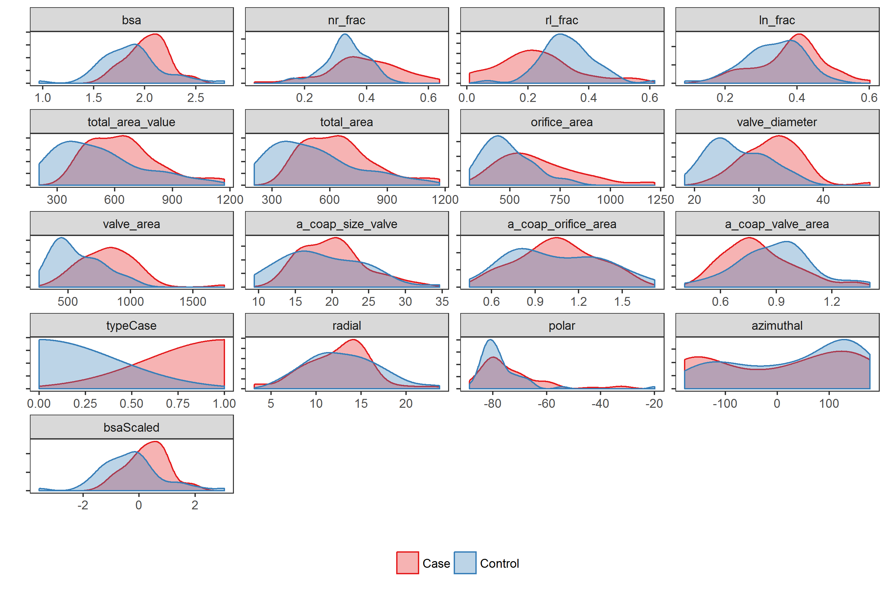
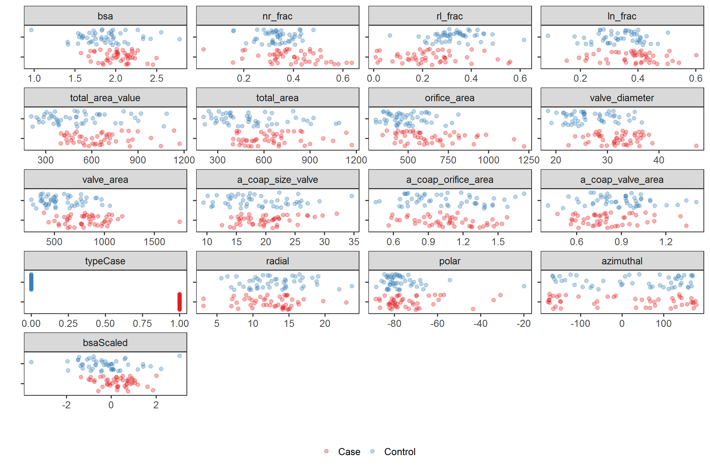
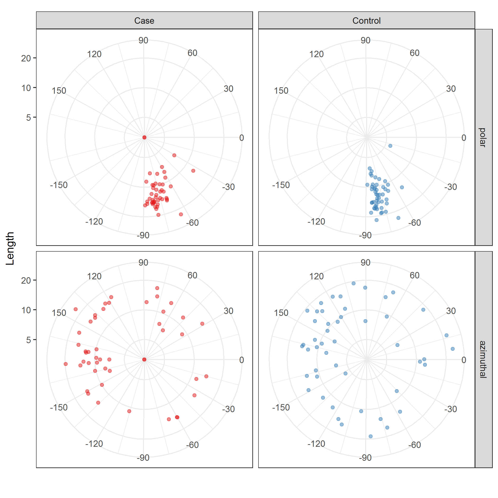
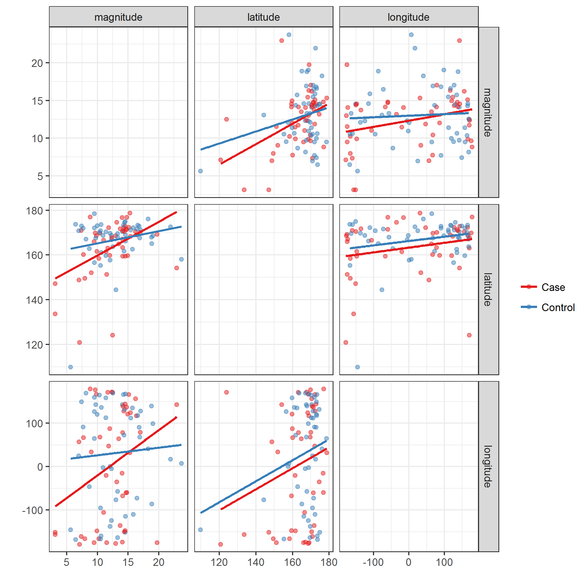

# Read anonymized data

Read and clean data.
R code is suppressed for brevity.
See [`read.Rmd`](../scripts/read.Rmd) for full details.

1. Read the Excel file
1. Rename columns
1. Remove patients with missing values for `nl`, `rl`, and `ln`
  * 2 cases, 1 control
1. Remove extraneous columns
1. Add logical indicator for `type` *Case*
1. Fix sign of `centroidBottomZ`
  * All values should be $<0$; a few were $>0$
1. Rotate the calculated centroid coordinates relative to "north", as defined by `nstar_X` and `nstar_Y`.
  * Rotate both the calculated and bottom centroids
1. Convert cartesian coordinates of rotated coaptation line to spherical coordinates
  * See function [`cart2sph`](../lib/cart2sph.R)
  * $\rho$ = radial distance
  * $\theta$ = latitude (i.e., polar angle or inclination) bounded between $(0, \pi)$ or $(0^{\circ}, 180^{\circ})$; default units is radians
  * $\phi$ = langitude (i.e., azimuthal angle or direction) bounded between $(-\pi, \pi)$ or $(-180^{\circ}, +180^{\circ})$; default units is radians
  * $\rho, \theta, \phi$ will be used to describe the coaptation line
1. Shift cartesian coordinates of the coaptation line to start at (0, 0, 0)
1. Normalize the orientation of the coaptation line to the unit sphere
1. Scale body size measures, `bsa` and `orifice_area`, to have mean = 0 and SD = 1

Example coaptation line (triple point) is below.
An interactive representation of the coaptation line geometry is [here](https://ggbm.at/CeF95YMN).


Check calculation of `magnitude` against given `coapt_line_length`; it should be 1.0


```
## Correlation between coapt_line_length and calculated magnitude is: 1.00000
```

Check correlation between body surface area, `bsa`, and other size variables.


|                    |       bsa|
|:-------------------|---------:|
|bsa                 | 1.0000000|
|total_area_value    | 0.4338917|
|total_area          | 0.4338311|
|orifice_area        | 0.3803151|
|valve_diameter      | 0.4380317|
|valve_area          | 0.4158363|
|a_coap_size_valve   | 0.3426494|
|a_coap_orifice_area | 0.1744180|
|a_coap_valve_area   | 0.0338661|
|magnitude           | 0.2923220|
|bsaScaled           | 1.0000000|
|orificeAreaScaled   | 0.3803151|

Output a subset for spot-checking.


```
## File ../data/processed/sphericalCoordinates.csv was written on 2017-02-16 11:44:29
```

Summarize the entire data set.


|type    |  n|
|:-------|--:|
|Case    | 48|
|Control | 49|
# Compare cases and controls

The case-control variable is `type`.


Plot comparisons.
Use multiple visualizations, density plots and scatterplots.
Each has their advantages and disadvantages.

Images are saved as [PNG](../figures/densityplots-1.png) and [SVG](../figures/densityplots.svg) files.





## Unadjusted/unscaled comparisons

Calculate mean (SD) and ranges.
Calculate differences in means.
Adjust p-values for multiple comparisons.


Output results.
Results save as [CSV](../data/processed/compare.csv).


|variable                                               | nCases|meanSDCases       |rangeCases          | nControls|meanSDControls    |rangeControls       |  difference|     seDiff| tStatistic|    pValue|   pAdjust|sig   |
|:------------------------------------------------------|------:|:-----------------|:-------------------|---------:|:-----------------|:-------------------|-----------:|----------:|----------:|---------:|---------:|:-----|
|Body surface area                                      |     48|2.026 (0.202)     |(1.572, 2.497)      |        49|1.866 (0.313)     |(0.964, 2.782)      |   0.1601531|  0.0536110|  2.9873184| 0.0035808| 0.0076732|TRUE  |
|NR fraction                                            |     48|0.391 (0.120)     |(0.037, 0.637)      |        49|0.335 (0.068)     |(0.157, 0.481)      |   0.0560878|  0.0197899|  2.8341556| 0.0056126| 0.0105236|TRUE  |
|RL fraction                                            |     48|0.228 (0.133)     |(0.009, 0.559)      |        49|0.331 (0.091)     |(0.067, 0.616)      |  -0.1029746|  0.0230101| -4.4751853| 0.0000212| 0.0000795|TRUE  |
|LN fraction                                            |     48|0.381 (0.094)     |(0.152, 0.602)      |        49|0.334 (0.081)     |(0.088, 0.504)      |   0.0468868|  0.0178691|  2.6239108| 0.0101284| 0.0168807|TRUE  |
|Total coaptation area, value                           |     48|648.704 (189.488) |(398.000, 1171.000) |        49|515.095 (224.243) |(206.000, 1087.660) | 133.6092730| 42.1952467|  3.1664532| 0.0020747| 0.0052041|TRUE  |
|Total coaptation area, calculated                      |     48|649.323 (189.494) |(398.560, 1171.491) |        49|515.761 (224.234) |(206.820, 1088.279) | 133.5623861| 42.1947005|  3.1653830| 0.0020816| 0.0052041|TRUE  |
|Orifice area                                           |     48|636.750 (196.511) |(341.000, 1221.000) |        49|486.755 (119.977) |(299.000, 812.000)  | 149.9948980| 32.9828869|  4.5476583| 0.0000160| 0.0000795|TRUE  |
|Valve diameter                                         |     48|32.110 (4.487)    |(22.450, 47.260)    |        49|26.676 (4.594)    |(18.480, 36.680)    |   5.4336692|  0.9223465|  5.8911368| 0.0000001| 0.0000009|TRUE  |
|Valve area                                             |     48|825.262 (234.532) |(395.843, 1754.193) |        49|575.142 (199.141) |(268.222, 1056.692) | 250.1206244| 44.1437443|  5.6660491| 0.0000002| 0.0000012|TRUE  |
|Total valve coaptation area relative to valve diameter |     48|20.084 (4.365)    |(12.528, 32.113)    |        49|18.743 (5.574)    |(9.409, 34.659)     |   1.3406005|  1.0179301|  1.3169868| 0.1910110| 0.2387638|FALSE |
|Total valve coaptation area relative to orifice area   |     48|1.059 (0.266)     |(0.559, 1.577)      |        49|1.047 (0.321)     |(0.449, 1.725)      |   0.0121495|  0.0599023|  0.2028216| 0.8397082| 0.8397082|FALSE |
|Total valve coaptation area relative to valve area     |     48|0.807 (0.191)     |(0.471, 1.338)      |        49|0.893 (0.203)     |(0.407, 1.405)      |  -0.0855492|  0.0400184| -2.1377445| 0.0351042| 0.0526563|FALSE |
|Coaptation line length                                 |     48|12.380 (3.753)    |(3.129, 22.951)     |        49|13.036 (4.003)    |(5.630, 23.724)     |  -0.6562349|  0.7882625| -0.8325081| 0.4072102| 0.4362966|FALSE |
|Latitude of coaptation line (top to bottom)            |     48|163.418 (12.494)  |(120.848, 178.720)  |        49|166.861 (10.433)  |(109.856, 178.508)  |  -3.4429561|  2.3351759| -1.4743883| 0.1436833| 0.1959318|FALSE |
|Longitude of coaptation line (direction)               |     48|4.684 (133.204)   |(-178.788, 178.824) |        49|31.443 (116.612)  |(-167.841, 169.432) | -26.7591262| 25.4045403| -1.0533206| 0.2948658| 0.3402297|FALSE |

```
## File ../data/processed/compare.csv was written on 2017-02-16 11:44:43
```
# Linear model of coaptation line length

## Unadjusted

Summary from linear model estimating coaptation line length by case or control group status,
**unadjusted.**

* Model statistics
* ANOVA table
* Predicted values, and confidence and prediction intervals


| r.squared| adj.r.squared| sigma| statistic| p.value| df|   logLik|     AIC|     BIC| deviance| df.residual|
|---------:|-------------:|-----:|---------:|-------:|--:|--------:|-------:|-------:|--------:|-----------:|
|     0.007|        -0.003| 3.882|     0.693|   0.407|  2| -268.181| 542.362| 550.086| 1431.301|          95|


|term        | estimate| std.error| statistic| p.value|
|:-----------|--------:|---------:|---------:|-------:|
|(Intercept) |    12.38|      0.56|     22.10|  0.0000|
|typeControl |     0.66|      0.79|      0.83|  0.4072|


|type    |   fit| lowerConf| upperConf| lowerPred| upperPred|
|:-------|-----:|---------:|---------:|---------:|---------:|
|Case    | 12.38|     11.27|     13.49|      4.59|     20.17|
|Control | 13.04|     11.93|     14.14|      5.25|     20.82|

**Interpretation**
Coaptation line length in the control population is, on average,
0.66 mm longer 
(95% CI: 
-0.89, 
2.2;
p-value:
0.4072)
than in the case population,
unadjusted.


## Adjusted for body surface area

Summary from linear model estimating coaptation line length by case or control group status,
**adjusted for body surface area.**

* Model statistics
* ANOVA table
* Predicted values, and confidence and prediction intervals


| r.squared| adj.r.squared| sigma| statistic| p.value| df|   logLik|     AIC|     BIC| deviance| df.residual|
|---------:|-------------:|-----:|---------:|-------:|--:|--------:|-------:|-------:|--------:|-----------:|
|     0.117|         0.099| 3.679|     6.249|   0.003|  3| -262.479| 532.959| 543.258| 1272.551|          94|


|term        | estimate| std.error| statistic| p.value|
|:-----------|--------:|---------:|---------:|-------:|
|(Intercept) |    11.98|      0.54|     22.05|  0.0000|
|typeControl |     1.44|      0.78|      1.84|  0.0685|
|bsaScaled   |     1.34|      0.39|      3.42|  0.0009|


|type    | bsaScaled|scaling             |   fit| lowerConf| upperConf| lowerPred| upperPred|
|:-------|---------:|:-------------------|-----:|---------:|---------:|---------:|---------:|
|Case    |        -1|-1 SD from mean BSA | 10.64|      9.18|     12.10|      3.19|     18.09|
|Case    |         0|Mean BSA            | 11.98|     10.90|     13.06|      4.60|     19.37|
|Case    |         1|+1 SD from mean BSA | 13.33|     12.14|     14.52|      5.93|     20.73|
|Control |        -1|-1 SD from mean BSA | 12.08|     10.90|     13.26|      4.68|     19.48|
|Control |         0|Mean BSA            | 13.42|     12.36|     14.49|      6.04|     20.81|
|Control |         1|+1 SD from mean BSA | 14.77|     13.32|     16.22|      7.32|     22.22|

**Interpretation**
Coaptation line length in the control population is, on average,
1.44 mm longer 
(95% CI: 
-0.09, 
2.97;
p-value:
0.0685)
than in the case population,
adjusted for body surface area.


## Adjusted for orifice area

Summary from linear model estimating coaptation line length by case or control group status,
**adjusted for orifice area.**

* Model statistics
* ANOVA table
* Predicted values, and confidence and prediction intervals


| r.squared| adj.r.squared| sigma| statistic| p.value| df|   logLik|     AIC|     BIC| deviance| df.residual|
|---------:|-------------:|-----:|---------:|-------:|--:|--------:|-------:|-------:|--------:|-----------:|
|     0.194|         0.177| 3.515|    11.343|       0|  3| -258.048| 524.097| 534.396| 1161.443|          94|


|term              | estimate| std.error| statistic| p.value|
|:-----------------|--------:|---------:|---------:|-------:|
|(Intercept)       |    11.59|      0.53|     21.69|   0.000|
|typeControl       |     2.21|      0.79|      2.81|   0.006|
|orificeAreaScaled |     1.85|      0.40|      4.67|   0.000|


|type    | orificeAreaScaled|scaling                      |   fit| lowerConf| upperConf| lowerPred| upperPred|
|:-------|-----------------:|:----------------------------|-----:|---------:|---------:|---------:|---------:|
|Case    |                -1|-1 SD from mean orifice area |  9.74|      8.24|     11.25|      2.60|     16.88|
|Case    |                 0|Mean orifice area            | 11.59|     10.53|     12.65|      4.53|     18.65|
|Case    |                 1|+1 SD from mean orifice area | 13.44|     12.34|     14.55|      6.38|     20.51|
|Control |                -1|-1 SD from mean orifice area | 11.96|     10.86|     13.05|      4.89|     19.02|
|Control |                 0|Mean orifice area            | 13.81|     12.76|     14.86|      6.75|     20.86|
|Control |                 1|+1 SD from mean orifice area | 15.66|     14.16|     17.15|      8.52|     22.79|

**Interpretation**
Coaptation line length in the control population is, on average,
2.21 mm longer 
(95% CI: 
0.67, 
3.76;
p-value:
0.006)
than in the case population,
adjusted for orifice area.
# Directional analysis of coaptation line

Citation for package `Directional`.


```
## 
## To cite package 'Directional' in publications use:
## 
##   Michail Tsagris, Giorgos Athineou and Anamul Sajib (2016).
##   Directional: Directional Statistics. R package version 2.3.
##   https://CRAN.R-project.org/package=Directional
## 
## A BibTeX entry for LaTeX users is
## 
##   @Manual{,
##     title = {Directional: Directional Statistics},
##     author = {Michail Tsagris and Giorgos Athineou and Anamul Sajib},
##     year = {2016},
##     note = {R package version 2.3},
##     url = {https://CRAN.R-project.org/package=Directional},
##   }
## 
## ATTENTION: This citation information has been auto-generated from
## the package DESCRIPTION file and may need manual editing, see
## 'help("citation")'.
```

I need to understand what package `Directional` is doing.
So echo back the R code.

Polar plot matrix of coaptation line angles: [PNG](figures/polarplot-1.png) or [SVG](figures/polarplot.svg)



```
## Saving 7 x 7 in image
```

Calculate median cartesian coordinates and latitude and longitude.
**These calculations look incorrect; need to troubleshoot.**


```r
cartCoord <- df %>% select(matches("^type$|coapUnit[XYZ]"))
matAll <- cartCoord %>% select(-1) %>% as.matrix
matCases <- cartCoord %>% filter(type == "Case") %>% select(-1) %>% as.matrix
matControls <- cartCoord %>% filter(type == "Control") %>% select(-1) %>% as.matrix
merge(rbind(matAll %>% mediandir,
            matCases %>% mediandir,
            matControls %>% mediandir) %>%
        data.frame %>%
        rename(x = X1, y = X2, z = X3) %>%
        cbind(group = c("All", "Cases", "Controls"), .),
      rbind(matAll %>% mediandir %>% euclid.inv,
            matCases %>% mediandir %>% euclid.inv,
            matControls %>% mediandir %>% euclid.inv) %>%
        data.frame %>%
        cbind(group = c("All", "Cases", "Controls"), .)) %>% 
  kable
```


|group    |         x|          y|          z|      Lat|     Long|
|:--------|---------:|----------:|----------:|--------:|--------:|
|All      | 0.1035612| -0.0428729| -0.9936986| 84.05572| 267.5295|
|Cases    | 0.1307252| -0.0319395| -0.9909040| 82.48850| 268.1538|
|Controls | 0.0788606| -0.0474871| -0.9957540| 85.47692| 267.2697|

Calculate maximum likelihood estimates of the von Mises-Fisher distribution.
**These calculations look incorrect; need to troubleshoot.**


```r
merge(rbind(matAll %>% vmf %>% .[["mu"]],
            matCases %>% vmf %>% .[["mu"]],
            matControls %>% vmf %>% .[["mu"]]) %>%
        data.frame %>% 
        rename(x = X1, y = X2, z = X3) %>% 
        cbind(group = c("All", "Cases", "Controls"), .),
      rbind(matAll %>% vmf %>% .[["mu"]] %>% euclid.inv,
            matCases %>% vmf %>% .[["mu"]] %>% euclid.inv,
            matControls %>% vmf %>% .[["mu"]] %>% euclid.inv) %>%
        data.frame %>% 
        cbind(group = c("All", "Cases", "Controls"), .)) %>% 
  kable
```


|group    |         x|          y|          z|      Lat|     Long|
|:--------|---------:|----------:|----------:|--------:|--------:|
|All      | 0.1019622| -0.0225069| -0.9945336| 84.14782| 268.7036|
|Cases    | 0.1426048| -0.0346619| -0.9891726| 81.80140| 267.9931|
|Controls | 0.0625443| -0.0107320| -0.9979845| 86.41413| 269.3839|

ANOVA.


```r
hcf.aov(matAll, factor(df$type))
```

```
##       test    p-value      kappa 
##  1.7657268  0.1738577 21.6647313
```

```r
lr.aov(matAll, factor(df$type))
```

```
##         w   p-value 
## 3.5742089 0.1674443
```

```r
embed.aov(matAll, factor(df$type))
```

```
##         F   p-value 
## 1.7768999 0.1719612
```

```r
het.aov(matAll, factor(df$type))
```

```
##      test   p-value 
## 3.5920396 0.1659581
```

```r
spherconc.test(matAll, factor(df$type))
```

```
## $mess
## [1] "The mean resultant length is more than 0.67. U3 was calculated"
## 
## $res
##      test   p-value 
## 2.2234523 0.1359288
```

Calculate circular summary statistics.


```r
cirCoord <- df %>% select(matches("^type$|latitude|longitude"))
matAll <- cirCoord %>% select(-1) %>% as.matrix
matCases <- cirCoord %>% filter(type == "Case") %>% select(-1) %>% as.matrix
matControls <- cirCoord %>% filter(type == "Control") %>% select(-1) %>% as.matrix
matAll[, "latitude"] %>% circ.summary(rads = FALSE, plot = FALSE)
```

```
## $mesos
## [1] 165.3458
## 
## $confint
## [1] 165.2728 165.4189
## 
## $kappa
## [1] 25.93036
## 
## $MRL
## [1] 0.980524
## 
## $circvariance
## [1] 0.01947597
## 
## $circstd
## [1] 0.1983337
```

```r
matAll[, "longitude"] %>% circ.summary(rads = FALSE, plot = FALSE)
```

```
## $mesos
## [1] 156.0474
## 
## $confint
## [1] 155.3553 156.7395
## 
## $kappa
## [1] 0.773375
## 
## $MRL
## [1] 0.3603926
## 
## $circvariance
## [1] 0.6396074
## 
## $circstd
## [1] 1.428679
```

```r
matCases[, "latitude"] %>% circ.summary(rads = FALSE, plot = FALSE)
```

```
## $mesos
## [1] 163.586
## 
## $confint
## [1] 163.4735 163.6985
## 
## $kappa
## [1] 22.25913
## 
## $MRL
## [1] 0.9772728
## 
## $circvariance
## [1] 0.0227272
## 
## $circstd
## [1] 0.2144269
```

```r
matCases[, "longitude"] %>% circ.summary(rads = FALSE, plot = FALSE)
```

```
## $mesos
## [1] 160.8957
## 
## $confint
## [1] 160.0409 161.7505
## 
## $kappa
## [1] 0.9018208
## 
## $MRL
## [1] 0.4105231
## 
## $circvariance
## [1] 0.5894769
## 
## $circstd
## [1] 1.334409
```

```r
matControls[, "latitude"]%>% circ.summary(rads = FALSE, plot = FALSE)
```

```
## $mesos
## [1] 167.0569
## 
## $confint
## [1] 166.9657 167.1480
## 
## $kappa
## [1] 32.72235
## 
## $MRL
## [1] 0.9845994
## 
## $circvariance
## [1] 0.01540057
## 
## $circstd
## [1] 0.1761839
```

```r
matControls[, "longitude"]%>% circ.summary(rads = FALSE, plot = FALSE)
```

```
## $mesos
## [1] 149.8446
## 
## $confint
## [1] 148.7197 150.9695
## 
## $kappa
## [1] 0.663083
## 
## $MRL
## [1] 0.3145656
## 
## $circvariance
## [1] 0.6854344
## 
## $circstd
## [1] 1.520896
```

Scatterplot matrix of coaptation line measures.
**Not useful; candidate for deletion.** 
 


```
## Saving 7 x 7 in image
```
 
Correlations.
Output from `circ.cor1` and `circ.cor2` are quite different.
**Need to reconcile.**


```r
circ.cor1(df$latitude, df$longitude, rads = FALSE)
```

```
##         rho     p-value 
## -0.18384547  0.07485033
```

```r
circ.cor2(df$latitude, df$longitude, rads = FALSE)
```

```
##        rho    p-value 
## 0.04200493 0.99654087
```

```r
circlin.cor(df$latitude, df[, c("magnitude", "bsa", "orifice_area")], rads = FALSE)
```

```
##       R-squared      p-value
## [1,] 0.12007523 0.0000118665
## [2,] 0.05463061 0.0058553758
## [3,] 0.04236606 0.0185962606
```

```r
circlin.cor(df$longitude, df[, c("magnitude", "bsa", "orifice_area")], rads = FALSE)
```

```
##        R-squared   p-value
## [1,] 0.052024485 0.0074860
## [2,] 0.003150427 0.7436825
## [3,] 0.017708820 0.1892279
```

ANOVA.


```r
hcf.circaov(matAll[, "latitude"], factor(df$type), rads = FALSE)
```

```
##       test    p-value      kappa 
##  2.2461896  0.1372596 25.9303615
```

```r
lr.circaov(matAll[, "latitude"], factor(df$type), rads = FALSE)
```

```
##       test    p-value      kappa 
##  2.2629933  0.1324977 25.9303615
```

```r
embed.circaov(matAll[, "latitude"], factor(df$type), rads = FALSE)
```

```
##       test    p-value      kappa 
##  2.2409746  0.1377114 25.9303615
```

```r
het.circaov(matAll[, "latitude"], factor(df$type), rads = FALSE)
```

```
##      test   p-value 
## 2.3060975 0.1288672
```

```r
conc.test(matAll[, "latitude"], factor(df$type), rads = FALSE)
```

```
## $mess
## [1] "The mean resultant length is more than 0.7. U3 was calculated"
## 
## $res
##      test   p-value 
## 1.7746721 0.1828049
```

```r
hcf.circaov(matAll[, "longitude"], factor(df$type), rads = FALSE)
```

```
##     test  p-value    kappa 
##       NA       NA 0.773375
```

```r
lr.circaov(matAll[, "longitude"], factor(df$type), rads = FALSE)
```

```
##      test   p-value     kappa 
## 0.2486268 0.6180437 0.7733750
```

```r
embed.circaov(matAll[, "longitude"], factor(df$type), rads = FALSE)
```

```
##      test   p-value     kappa 
## 0.2202366 0.6399350 0.7733750
```

```r
het.circaov(matAll[, "longitude"], factor(df$type), rads = FALSE)
```

```
##      test   p-value 
## 0.2411616 0.6233684
```

```r
conc.test(matAll[, "longitude"], factor(df$type), rads = FALSE)
```

```
## Error in conc.test(matAll[, "longitude"], factor(df$type), rads = FALSE): object 'U3' not found
```


## Circular regression for latitude (polar angle)

Unadjusted.


```r
new <- df$typeCase %>% unique
M <- spml.reg(df$latitude, 
              as.matrix(df[, "typeCase"]), 
              rads = FALSE, 
              xnew = as.matrix(new))
M
```

```
## $runtime
##    user  system elapsed 
##    0.04    0.02    0.03 
## 
## $beta
##          Cosinus of y  Sinus of y
##             -6.021609 1.331727706
## typeCase     1.344292 0.006409535
## 
## $seb
##          Cosinus of y Sinus of y
##            0.09922338  0.1414975
## typeCase   0.20295968  0.2024861
## 
## $loglik
## [1] 25.35768
## 
## $est
## [1] 164.0347 167.5293
```

```r
data.frame(type = df$type %>% unique, 
           typeCase = new,
           pred = as.vector(M$est) - 360) %>% kable
```


|type    |typeCase |      pred|
|:-------|:--------|---------:|
|Case    |TRUE     | -195.9653|
|Control |FALSE    | -192.4707|

Adjusted for body surface area.


```r
new <- data.frame(typeCase = rep(df$typeCase %>% unique, 3), 
                  bsaScaled = rep(-1:1, each = 2))
M <- spml.reg(df$latitude, 
              as.matrix(df[, c("typeCase", "bsaScaled")]), 
              rads = FALSE, 
              xnew = as.matrix(new))
M
```

```
## $runtime
##    user  system elapsed 
##    0.12    0.01    0.07 
## 
## $beta
##           Cosinus of y Sinus of y
##              -8.383290  1.7520884
## typeCase      3.356043 -0.3037059
## bsaScaled    -2.198097  0.3094801
## 
## $seb
##           Cosinus of y Sinus of y
##              0.1016933  0.1456561
## typeCase     0.2120909  0.2104136
## bsaScaled    0.1061819  0.1044269
## 
## $loglik
## [1] 42.12291
## 
## $est
## [1] 158.0723 166.8713 163.9280 168.1952 166.3261 168.9752
```

```r
data.frame(type = rep(df$type %>% unique, 3),
           new,
           scaling = rep(c("-1 SD from mean BSA",
                           "Mean BSA",
                           "+1 SD from mean BSA"), each = 2),
           pred = as.vector(M$est) - 360) %>% kable
```


|type    |typeCase | bsaScaled|scaling             |      pred|
|:-------|:--------|---------:|:-------------------|---------:|
|Case    |TRUE     |        -1|-1 SD from mean BSA | -201.9277|
|Control |FALSE    |        -1|-1 SD from mean BSA | -193.1287|
|Case    |TRUE     |         0|Mean BSA            | -196.0720|
|Control |FALSE    |         0|Mean BSA            | -191.8048|
|Case    |TRUE     |         1|+1 SD from mean BSA | -193.6739|
|Control |FALSE    |         1|+1 SD from mean BSA | -191.0248|

Adjusted for orifice area area.


```r
new <- data.frame(typeCase = rep(df$typeCase %>% unique, 3), 
                  orificeAreaScaled = rep(-1:1, each = 2))
M <- spml.reg(df$latitude, 
              as.matrix(df[, c("typeCase", "orificeAreaScaled")]), 
              rads = FALSE, 
              xnew = as.matrix(new))
M
```

```
## $runtime
##    user  system elapsed 
##    0.09    0.00    0.05 
## 
## $beta
##                   Cosinus of y Sinus of y
##                      -8.120715  1.6054003
## typeCase              3.106066 -0.1043417
## orificeAreaScaled    -2.454024  0.1893907
## 
## $seb
##                   Cosinus of y Sinus of y
##                      0.1057656  0.1509385
## typeCase             0.2236157  0.2212410
## orificeAreaScaled    0.1122844  0.1106559
## 
## $loglik
## [1] 40.81098
## 
## $est
## [1] 152.8764 165.9701 163.3357 168.8173 167.2466 170.3673
```

```r
data.frame(type = rep(df$type %>% unique, 3),
           new,
           scaling = rep(c("-1 SD from mean orifice area",
                           "Mean orifice area",
                           "+1 SD from mean orifice area"), each = 2),
           pred = as.vector(M$est) - 360) %>% kable
```


|type    |typeCase | orificeAreaScaled|scaling                      |      pred|
|:-------|:--------|-----------------:|:----------------------------|---------:|
|Case    |TRUE     |                -1|-1 SD from mean orifice area | -207.1236|
|Control |FALSE    |                -1|-1 SD from mean orifice area | -194.0299|
|Case    |TRUE     |                 0|Mean orifice area            | -196.6643|
|Control |FALSE    |                 0|Mean orifice area            | -191.1827|
|Case    |TRUE     |                 1|+1 SD from mean orifice area | -192.7534|
|Control |FALSE    |                 1|+1 SD from mean orifice area | -189.6327|


## Circular regression for longitude (azimuthal angle)

Unadjusted.


```r
new <- df$typeCase %>% unique
M <- spml.reg(df$longitude, 
              as.matrix(df[, "typeCase"]), 
              rads = FALSE, 
              xnew = as.matrix(new))
M
```

```
## $runtime
##    user  system elapsed 
##       0       0       0 
## 
## $beta
##          Cosinus of y  Sinus of y
##            -0.4600674  0.27089631
## typeCase   -0.2294334 -0.06964816
## 
## $seb
##          Cosinus of y Sinus of y
##             0.1192794  0.1347447
## typeCase    0.1991933  0.2034726
## 
## $loglik
## [1] -164.3917
## 
## $est
## [1] 163.7288 149.5096
```

```r
data.frame(type = df$type %>% unique, 
           typeCase = new,
           pred = as.vector(M$est) - 360) %>% kable
```


|type    |typeCase |      pred|
|:-------|:--------|---------:|
|Case    |TRUE     | -196.2712|
|Control |FALSE    | -210.4904|

Adjusted for body surface area.


```r
new <- data.frame(typeCase = rep(df$typeCase %>% unique, 3), 
                  bsaScaled = rep(-1:1, each = 2))
M <- spml.reg(df$longitude, 
              as.matrix(df[, c("typeCase", "bsaScaled")]), 
              rads = FALSE, 
              xnew = as.matrix(new))
M
```

```
## $runtime
##    user  system elapsed 
##    0.03    0.00    0.01 
## 
## $beta
##           Cosinus of y  Sinus of y
##             -0.4277925  0.27503757
## typeCase    -0.3015519 -0.07924063
## bsaScaled    0.1144437  0.01654991
## 
## $seb
##           Cosinus of y Sinus of y
##              0.1275069  0.1376270
## typeCase     0.2062491  0.2128108
## bsaScaled    0.1050178  0.1066545
## 
## $loglik
## [1] -163.9478
## 
## $est
## [1] 168.0069 154.5125 164.9729 147.2621 160.9484 137.0602
```

```r
data.frame(type = rep(df$type %>% unique, 3),
           new,
           scaling = rep(c("-1 SD from mean BSA",
                           "Mean BSA",
                           "+1 SD from mean BSA"), each = 2),
           pred = as.vector(M$est) - 360) %>% kable
```


|type    |typeCase | bsaScaled|scaling             |      pred|
|:-------|:--------|---------:|:-------------------|---------:|
|Case    |TRUE     |        -1|-1 SD from mean BSA | -191.9931|
|Control |FALSE    |        -1|-1 SD from mean BSA | -205.4875|
|Case    |TRUE     |         0|Mean BSA            | -195.0271|
|Control |FALSE    |         0|Mean BSA            | -212.7379|
|Case    |TRUE     |         1|+1 SD from mean BSA | -199.0516|
|Control |FALSE    |         1|+1 SD from mean BSA | -222.9398|

Adjusted for orifice area area.


```r
new <- data.frame(typeCase = rep(df$typeCase %>% unique, 3), 
                  orificeAreaScaled = rep(-1:1, each = 2))
M <- spml.reg(df$longitude, 
              as.matrix(df[, c("typeCase", "orificeAreaScaled")]), 
              rads = FALSE, 
              xnew = as.matrix(new))
M
```

```
## $runtime
##    user  system elapsed 
##       0       0       0 
## 
## $beta
##                   Cosinus of y  Sinus of y
##                     -0.3582187  0.25927990
## typeCase            -0.4622895 -0.05843433
## orificeAreaScaled    0.2644774 -0.02736773
## 
## $seb
##                   Cosinus of y Sinus of y
##                      0.1395525  0.1447753
## typeCase             0.2122474  0.2241783
## orificeAreaScaled    0.1048306  0.1117893
## 
## $loglik
## [1] -162.4629
## 
## $est
## [1] 168.1217 155.2818 166.2455 144.1029 162.6724 112.0090
```

```r
data.frame(type = rep(df$type %>% unique, 3),
           new,
           scaling = rep(c("-1 SD from mean orifice area",
                           "Mean orifice area",
                           "+1 SD from mean orifice area"), each = 2),
           pred = as.vector(M$est) - 360) %>% kable
```


|type    |typeCase | orificeAreaScaled|scaling                      |      pred|
|:-------|:--------|-----------------:|:----------------------------|---------:|
|Case    |TRUE     |                -1|-1 SD from mean orifice area | -191.8783|
|Control |FALSE    |                -1|-1 SD from mean orifice area | -204.7182|
|Case    |TRUE     |                 0|Mean orifice area            | -193.7545|
|Control |FALSE    |                 0|Mean orifice area            | -215.8971|
|Case    |TRUE     |                 1|+1 SD from mean orifice area | -197.3276|
|Control |FALSE    |                 1|+1 SD from mean orifice area | -247.9910|
