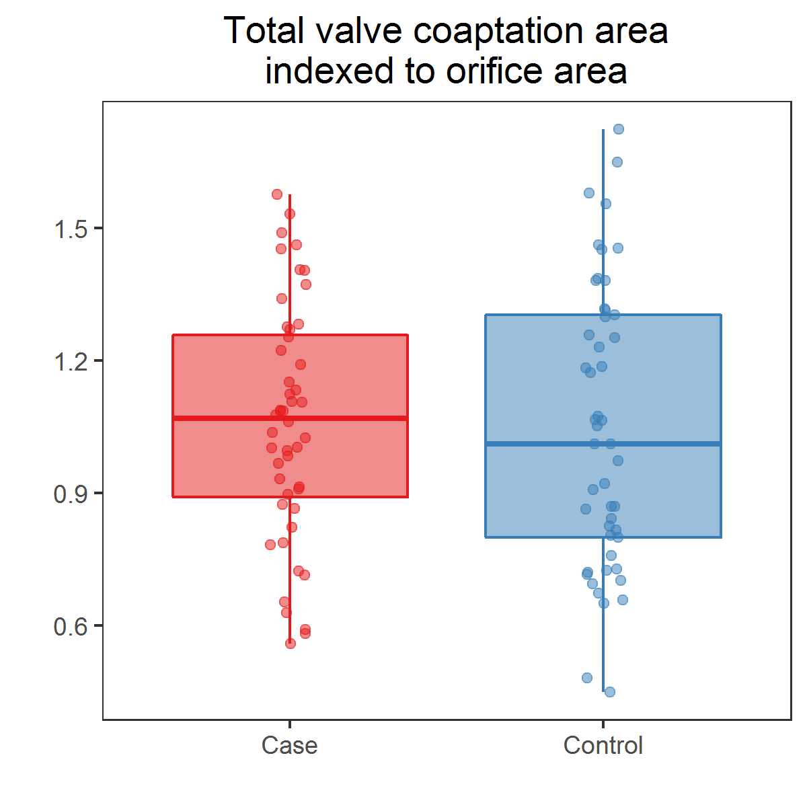
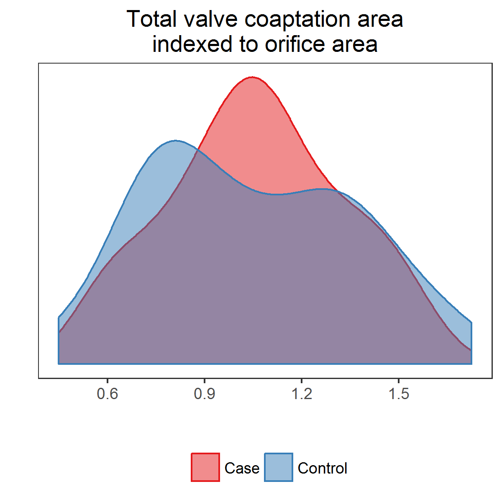

# Read anonymized data

Read and clean data.
R code is suppressed for brevity.
See [`read.Rmd`](../scripts/read.Rmd) for full details.

1. Read the Excel file
1. Rename columns
1. Remove patients with missing values for `nl`, `rl`, and `ln`
  * 2 cases, 1 control
1. Remove extraneous columns
1. Add logical indicator for `type` *Case*
1. Fix sign of `centroidBottomZ`
  * All values should be $<0$; a few were $>0$
1. Rotate the calculated centroid coordinates relative to "north", as defined by `nstar_X` and `nstar_Y`.
  * Rotate both the calculated and bottom centroids
1. Convert cartesian coordinates of rotated coaptation line to spherical coordinates
  * See function [`cart2sph`](../lib/cart2sph.R)
  * $\rho$ = radial distance
  * $\theta$ = latitude (i.e., polar angle or inclination) bounded between $(0, \pi)$ or $(0^{\circ}, 180^{\circ})$; default units is radians
  * $\phi$ = langitude (i.e., azimuthal angle or direction) bounded between $(-\pi, \pi)$ or $(-180^{\circ}, +180^{\circ})$; default units is radians
  * $\rho, \theta, \phi$ will be used to describe the coaptation line
1. Shift cartesian coordinates of the coaptation line to start at (0, 0, 0)
1. Normalize the orientation of the coaptation line to the unit sphere
1. Scale body size measures, `bsa` and `orifice_area`, to have mean = 0 and SD = 1
1. Lump categories of aortic stenosis, `as`, and aortic regurgitation (insufficiency), `ar`

Example coaptation line (triple point) is below.
An interactive representation of the coaptation line geometry is [here](https://ggbm.at/CeF95YMN).


Check calculation of `magnitude` against given `coapt_line_length`; it should be 1.0


```
## Correlation between coapt_line_length and calculated magnitude is: 1.00000
```

Check correlation between body surface area, `bsa`, and other size variables.


|                    |       bsa|
|:-------------------|---------:|
|bsa                 | 1.0000000|
|total_area_value    | 0.4338917|
|total_area          | 0.4338311|
|orifice_area        | 0.3803151|
|valve_diameter      | 0.4380317|
|valve_area          | 0.4158363|
|a_coap_size_valve   | 0.3426494|
|a_coap_orifice_area | 0.1744180|
|a_coap_valve_area   | 0.0338661|
|magnitude           | 0.2923220|
|bsaScaled           | 1.0000000|
|orificeAreaScaled   | 0.3803151|
|magnitudeScaled     | 0.2923220|

Output a subset for spot-checking.


```
## File ../data/processed/sphericalCoordinates.csv was written on 2017-04-11 09:09:29
```

Summarize the entire data set.


|type    |  n|
|:-------|--:|
|Case    | 48|
|Control | 49|
# Compare means

Calculate mean (SD) and ranges.
Calculate differences in means.
Test differences between cases and controls.


|Variable                                               |Mean (SD), Cases |Mean (SD), Controls | Mean difference| P-value|Significance |
|:------------------------------------------------------|:----------------|:-------------------|---------------:|-------:|:------------|
|Total coaptation area, value                           |649 (189)        |515 (224)           |         133.609|   0.002|TRUE         |
|Orifice area                                           |637 (197)        |487 (120)           |         149.995|   0.000|TRUE         |
|Valve diameter                                         |32.1 (4.49)      |26.7 (4.59)         |           5.434|   0.000|TRUE         |
|Valve area                                             |825 (235)        |575 (199)           |         250.121|   0.000|TRUE         |
|Total valve coaptation area relative to valve diameter |20.1 (4.37)      |18.7 (5.57)         |           1.341|   0.191|FALSE        |
|Total valve coaptation area relative to orifice area   |1.06 (0.266)     |1.05 (0.321)        |           0.012|   0.840|FALSE        |
|Total valve coaptation area relative to valve area     |0.807 (0.191)    |0.893 (0.203)       |          -0.086|   0.035|TRUE         |
|Coaptation line length                                 |12.4 (3.75)      |13 (4)              |          -0.656|   0.407|FALSE        |

# Compare total coaptation areas

[PNG](../figures/boxplotsTotalCoaptationArea.png), [SVG](../figures/boxplotsTotalCoaptationArea.svg)




[PNG](../figures/violinplotsTotalCoaptationArea.png), [SVG](../figures/violinplotsTotalCoaptationArea.svg)


[PNG](../figures/densityTotalCoaptationArea.png), [SVG](../figures/densityTotalCoaptationArea.svg)




# Compare leaflet coaptation fractions

Comparison variables are

* `nr_frac` Fraction of coaptation area between non-coronary and right coronary leaflets of total coaptation area
* `rl_frac` Fraction of coaptation area between right and left coronary leaflets of total coaptation area
* `ln_frac` Fraction of coaptation area between left coronary and non-coronary leaflets of total coaptation areas

[PNG](../figures/lineplotsLeafletsCoapFrac.png), [SVG](../figures/lineplotsLeafletCoapFrac.svg)


Use a linear model to test if leaflet fractions are different.


* Among cases
  * NR and LN are not significantly different (p = 0.635)
  * RL is significantly different from NR and LN (p = 0.000)
* Among controls
  * NR and LN are not significantly different (p = 0.979)
  * RL is not significantly different from NR and LN (p = 0.855)
  * NR, RL, and LN are not significantly different from each other (p = 0.876)
* Between cases and controls
  * RL is significantly different (p = 0.000)


|contrast                 |         p|
|:------------------------|---------:|
|Cases: NR vs LN          | 0.6346002|
|Cases: RL vs NR & LN     | 0.0000000|
|Controls: NR vs LN       | 0.9793845|
|Controls: RL vs NR & LN  | 0.8552162|
|Controls: NR vs RL vs LN | 0.8755377|
|RL: Cases vs Controls    | 0.0000007|


|term                                   | estimate| std.error| statistic| p.value|
|:--------------------------------------|--------:|---------:|---------:|-------:|
|(Intercept)                            |    0.391|     0.014|    27.043|   0.000|
|typeControl                            |   -0.056|     0.020|    -2.758|   0.006|
|variableRight
Left                     |   -0.163|     0.020|    -7.963|   0.000|
|variableLeft
Non-corronary             |   -0.010|     0.020|    -0.476|   0.635|
|typeControl:variableRight
Left         |    0.159|     0.029|     5.531|   0.000|
|typeControl:variableLeft
Non-corronary |    0.009|     0.029|     0.320|   0.749|
# Compare coaptation lines in 3D space

Observed coaptation lines.


[Interactive HTML](../figures/webGL/sphereplotObservedCoapLines.html)

Calculate predicted coaptation lines from MANOVA.
Adjust for scaled orifice area, `orificeAreaScaled`.


|type    | orificeAreaScaled| coapX| coapY|  coapZ|   long|    lat| radius|
|:-------|-----------------:|-----:|-----:|------:|------:|------:|------:|
|Case    |                 0|  1.66| -0.52| -10.90| -17.39| -80.93|  11.04|
|Control |                 0|  0.33| -0.27| -13.45| -39.29| -88.18|  13.46|

Predicted coaptation lines.


[Interactive HTML](../figures/webGL/sphereplotPredictedCoapLines.html)

**Coaptation lines are not significantly different (p = 0.166).**

Show MANOVA details.


|term              | df|    pillai| statistic| num.df| den.df|   p.value|
|:-----------------|--:|---------:|---------:|------:|------:|---------:|
|type              |  1| 0.0533970|  1.729879|      3|     92| 0.1663346|
|orificeAreaScaled |  1| 0.2204778|  8.673671|      3|     92| 0.0000397|

```
##  Response coapX :
##                   Df Sum Sq Mean Sq F value  Pr(>F)  
## type               1  22.47 22.4743  3.6570 0.05888 .
## orificeAreaScaled  1  15.39 15.3926  2.5047 0.11687  
## Residuals         94 577.69  6.1456                  
## ---
## Signif. codes:  0 '***' 0.001 '**' 0.01 '*' 0.05 '.' 0.1 ' ' 1
## 
##  Response coapY :
##                   Df Sum Sq Mean Sq F value Pr(>F)
## type               1   2.52  2.5248  0.5557 0.4579
## orificeAreaScaled  1   0.65  0.6546  0.1441 0.7051
## Residuals         94 427.08  4.5434               
## 
##  Response coapZ :
##                   Df  Sum Sq Mean Sq F value    Pr(>F)    
## type               1   17.24   17.24   1.339    0.2502    
## orificeAreaScaled  1  322.63  322.63  25.063 2.585e-06 ***
## Residuals         94 1210.04   12.87                      
## ---
## Signif. codes:  0 '***' 0.001 '**' 0.01 '*' 0.05 '.' 0.1 ' ' 1
```
