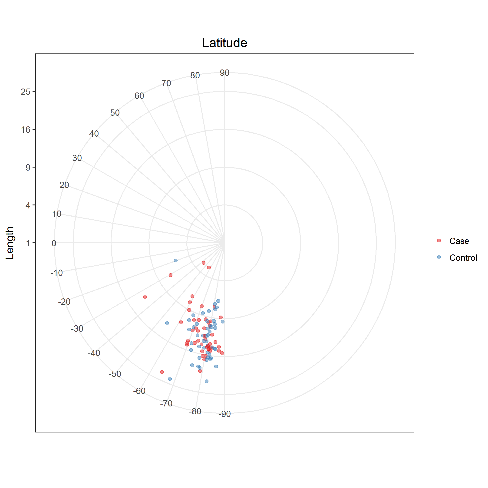
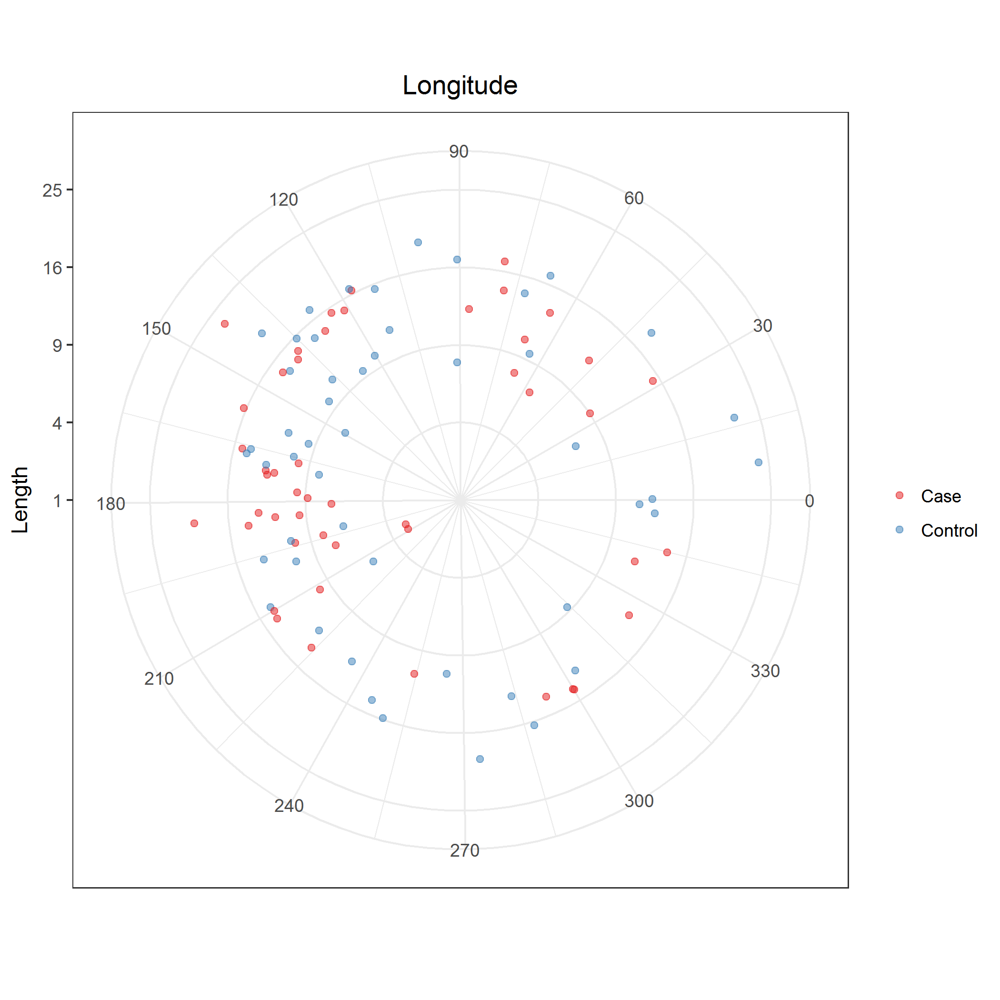

# Directional analysis of coaptation line

Citation for package `Directional`.

```{r}
citation("Directional")
```

I need to understand what package `Directional` is doing.
So echo back the R code.

Polar plots of coaptation line angles

* Latitude: [PNG](../figures/plotLatitude.png), [SVG](../figures/plotLatitude.svg)  
  
* Longitude: [PNG](figures/plotLongitude.png), [SVG](../figures/plotLongitude.svg)  
  

```{r plotLatitude, dpi = 300, fig.show = "hide"}
df %>%
  select(matches("^id|^type$|^latitude$")) %>%
  melt(id.vars = c("id", "type")) %>% 
  mutate(type = factor(type)) %>% 
  merge(., df %>% select(matches("^id|^type|^magnitude$"))) %>% 
  ggplot +
    labs(title = "Latitude") + 
    aes(x = value, y = magnitude, color = type, fill = type) +
    geom_point(alpha = 1/2) +
    scale_color_brewer("", palette = "Set1") +
    scale_fill_brewer("", palette = "Set1") +
    scale_x_continuous("", breaks = seq(-90, 90, 10), limits = c(-180, 180)) +
    scale_y_sqrt("Length", breaks = (1:5)^2, limits = c(1, 25)) +
    coord_polar(start = pi / 2, direction = 1) +
    theme_bw() +
    theme(panel.grid.minor = element_blank(),
          plot.title = element_text(hjust = 0.5))
ggsave("../figures/plotLatitude.png", dpi = 300)
ggsave("../figures/plotLatitude.svg", dpi = 300)
```

```{r plotLongitude, dpi = 300, fig.show = "hide"}
df %>%
  select(matches("^id|^type$|^longitude$")) %>%
  melt(id.vars = c("id", "type")) %>% 
  mutate(type = factor(type)) %>% 
  merge(., df %>% select(matches("^id|^type|^magnitude$"))) %>% 
  ggplot +
    labs(title = "Longitude") + 
    aes(x = value, y = magnitude, color = type, fill = type) +
    geom_point(alpha = 1/2) +
    scale_color_brewer("", palette = "Set1") +
    scale_fill_brewer("", palette = "Set1") +
    scale_x_continuous("", breaks = seq(0, 360, 30), limits = c(0, 359)) +
    scale_y_sqrt("Length", breaks = (1:5)^2, limits = c(1, 25)) +
    coord_polar(start = 0, direction = 1) +
    theme_bw() +
    theme(plot.title = element_text(hjust = 0.5))
ggsave("../figures/plotLongitude.png", dpi = 300)
ggsave("../figures/plotLongitude.svg", dpi = 300)
```

Calculate median cartesian coordinates and latitude and longitude.
**These calculations look incorrect; need to troubleshoot.**

```{r, echo = TRUE}
cartCoord <- df %>% select(matches("^type$|coapUnit[XYZ]"))
matAll <- cartCoord %>% select(-1) %>% as.matrix
matCases <- cartCoord %>% filter(type == "Case") %>% select(-1) %>% as.matrix
matControls <- cartCoord %>% filter(type == "Control") %>% select(-1) %>% as.matrix
merge(rbind(matAll %>% mediandir,
            matCases %>% mediandir,
            matControls %>% mediandir) %>%
        data.frame %>%
        rename(x = X1, y = X2, z = X3) %>%
        cbind(group = c("All", "Cases", "Controls"), .),
      rbind(matAll %>% mediandir %>% euclid.inv,
            matCases %>% mediandir %>% euclid.inv,
            matControls %>% mediandir %>% euclid.inv) %>%
        data.frame %>%
        cbind(group = c("All", "Cases", "Controls"), .)) %>% 
  kable
```

Calculate maximum likelihood estimates of the von Mises-Fisher distribution.
**These calculations look incorrect; need to troubleshoot.**

```{r, echo = TRUE}
merge(rbind(matAll %>% vmf %>% .[["mu"]],
            matCases %>% vmf %>% .[["mu"]],
            matControls %>% vmf %>% .[["mu"]]) %>%
        data.frame %>% 
        rename(x = X1, y = X2, z = X3) %>% 
        cbind(group = c("All", "Cases", "Controls"), .),
      rbind(matAll %>% vmf %>% .[["mu"]] %>% euclid.inv,
            matCases %>% vmf %>% .[["mu"]] %>% euclid.inv,
            matControls %>% vmf %>% .[["mu"]] %>% euclid.inv) %>%
        data.frame %>% 
        cbind(group = c("All", "Cases", "Controls"), .)) %>% 
  kable
```

ANOVA.

```{r, echo = TRUE}
hcf.aov(matAll, factor(df$type))
lr.aov(matAll, factor(df$type))
embed.aov(matAll, factor(df$type))
het.aov(matAll, factor(df$type))
spherconc.test(matAll, factor(df$type))
```

Calculate circular summary statistics.

```{r, echo = TRUE}
cirCoord <- df %>% select(matches("^type$|latitude|longitude"))
matAll <- cirCoord %>% select(-1) %>% as.matrix
matCases <- cirCoord %>% filter(type == "Case") %>% select(-1) %>% as.matrix
matControls <- cirCoord %>% filter(type == "Control") %>% select(-1) %>% as.matrix
matAll[, "latitude"] %>% circ.summary(rads = FALSE, plot = FALSE)
matAll[, "longitude"] %>% circ.summary(rads = FALSE, plot = FALSE)
matCases[, "latitude"] %>% circ.summary(rads = FALSE, plot = FALSE)
matCases[, "longitude"] %>% circ.summary(rads = FALSE, plot = FALSE)
matControls[, "latitude"]%>% circ.summary(rads = FALSE, plot = FALSE)
matControls[, "longitude"]%>% circ.summary(rads = FALSE, plot = FALSE)
```

Scatterplot matrix of coaptation line measures.
**Not useful; candidate for deletion.** 
 
```{r scatterplotMatrixCoaptationLine, dpi = 300} 
df %>% 
  select(matches("^id|^type$|^(magnitude|latitude|longitude)$")) %>% 
  melt(id.vars = c("id", "type")) %>%  
  mutate(type = factor(type)) %>%  
  merge(., ., by = c("id", "type")) %>%  
  filter(variable.x != variable.y) %>%  
  ggplot + 
    aes(x = value.x, y = value.y, color = type) + 
    geom_point(alpha = 1/2) + 
    geom_smooth(method = "lm", se = FALSE) + 
    scale_color_brewer("", palette = "Set1") + 
    scale_x_continuous("") + 
    scale_y_continuous("") + 
    facet_grid(variable.y ~ variable.x, scales = "free") + 
    theme_bw() 
ggsave("../figures/scatterplotMatrixCoaptationLine.svg", dpi = 300) 
``` 
 
Correlations.
Output from `circ.cor1` and `circ.cor2` are quite different.
**Need to reconcile.**

```{r, echo = TRUE}
circ.cor1(df$latitude, df$longitude, rads = FALSE)
circ.cor2(df$latitude, df$longitude, rads = FALSE)
circlin.cor(df$latitude, df[, c("magnitude", "bsa", "orifice_area")], rads = FALSE)
circlin.cor(df$longitude, df[, c("magnitude", "bsa", "orifice_area")], rads = FALSE)
```

ANOVA.

```{r, echo = TRUE}
hcf.circaov(matAll[, "latitude"], factor(df$type), rads = FALSE)
lr.circaov(matAll[, "latitude"], factor(df$type), rads = FALSE)
embed.circaov(matAll[, "latitude"], factor(df$type), rads = FALSE)
het.circaov(matAll[, "latitude"], factor(df$type), rads = FALSE)
conc.test(matAll[, "latitude"], factor(df$type), rads = FALSE)
hcf.circaov(matAll[, "longitude"], factor(df$type), rads = FALSE)
lr.circaov(matAll[, "longitude"], factor(df$type), rads = FALSE)
embed.circaov(matAll[, "longitude"], factor(df$type), rads = FALSE)
het.circaov(matAll[, "longitude"], factor(df$type), rads = FALSE)
conc.test(matAll[, "longitude"], factor(df$type), rads = FALSE)
```


## Circular regression for latitude (polar angle)

Unadjusted.

```{r, echo = TRUE}
new <- df$typeCase %>% unique
M <- spml.reg(df$latitude, 
              as.matrix(df[, "typeCase"]), 
              rads = FALSE, 
              xnew = as.matrix(new))
M
data.frame(type = df$type %>% unique, 
           typeCase = new,
           pred = as.vector(M$est) - 360) %>% kable
```

Adjusted for body surface area.

```{r, echo = TRUE}
new <- data.frame(typeCase = rep(df$typeCase %>% unique, 3), 
                  bsaScaled = rep(-1:1, each = 2))
M <- spml.reg(df$latitude, 
              as.matrix(df[, c("typeCase", "bsaScaled")]), 
              rads = FALSE, 
              xnew = as.matrix(new))
M
data.frame(type = rep(df$type %>% unique, 3),
           new,
           scaling = rep(c("-1 SD from mean BSA",
                           "Mean BSA",
                           "+1 SD from mean BSA"), each = 2),
           pred = as.vector(M$est) - 360) %>% kable
```

Adjusted for orifice area area.

```{r, echo = TRUE}
new <- data.frame(typeCase = rep(df$typeCase %>% unique, 3), 
                  orificeAreaScaled = rep(-1:1, each = 2))
M <- spml.reg(df$latitude, 
              as.matrix(df[, c("typeCase", "orificeAreaScaled")]), 
              rads = FALSE, 
              xnew = as.matrix(new))
M
data.frame(type = rep(df$type %>% unique, 3),
           new,
           scaling = rep(c("-1 SD from mean orifice area",
                           "Mean orifice area",
                           "+1 SD from mean orifice area"), each = 2),
           pred = as.vector(M$est) - 360) %>% kable
```

Adjusted for coaptation line length.

```{r, echo = TRUE}
new <- data.frame(typeCase = rep(df$typeCase %>% unique, 3), 
                  magnitudeScaled = rep(-1:1, each = 2))
M <- spml.reg(df$latitude, 
              as.matrix(df[, c("typeCase", "magnitudeScaled")]), 
              rads = FALSE, 
              xnew = as.matrix(new))
M
data.frame(type = rep(df$type %>% unique, 3),
           new,
           scaling = rep(c("-1 SD from mean coaptation line length",
                           "Mean coaptation line length",
                           "+1 SD from mean coaptation line length"), each = 2),
           pred = as.vector(M$est) - 360) %>% kable
```

## Circular regression for longitude (azimuthal angle)

Unadjusted.

```{r, echo = TRUE}
new <- df$typeCase %>% unique
M <- spml.reg(df$longitude, 
              as.matrix(df[, "typeCase"]), 
              rads = FALSE, 
              xnew = as.matrix(new))
M
data.frame(type = df$type %>% unique, 
           typeCase = new,
           pred = as.vector(M$est) - 360) %>% kable
```

Adjusted for body surface area.

```{r, echo = TRUE}
new <- data.frame(typeCase = rep(df$typeCase %>% unique, 3), 
                  bsaScaled = rep(-1:1, each = 2))
M <- spml.reg(df$longitude, 
              as.matrix(df[, c("typeCase", "bsaScaled")]), 
              rads = FALSE, 
              xnew = as.matrix(new))
M
data.frame(type = rep(df$type %>% unique, 3),
           new,
           scaling = rep(c("-1 SD from mean BSA",
                           "Mean BSA",
                           "+1 SD from mean BSA"), each = 2),
           pred = as.vector(M$est) - 360) %>% kable
```

Adjusted for orifice area area.

```{r, echo = TRUE}
new <- data.frame(typeCase = rep(df$typeCase %>% unique, 3), 
                  orificeAreaScaled = rep(-1:1, each = 2))
M <- spml.reg(df$longitude, 
              as.matrix(df[, c("typeCase", "orificeAreaScaled")]), 
              rads = FALSE, 
              xnew = as.matrix(new))
M
data.frame(type = rep(df$type %>% unique, 3),
           new,
           scaling = rep(c("-1 SD from mean orifice area",
                           "Mean orifice area",
                           "+1 SD from mean orifice area"), each = 2),
           pred = as.vector(M$est) - 360) %>% kable
```

Adjusted for coaptation line length.

```{r, echo = TRUE}
new <- data.frame(typeCase = rep(df$typeCase %>% unique, 3), 
                  magnitudeScaled = rep(-1:1, each = 2))
M <- spml.reg(df$longitude, 
              as.matrix(df[, c("typeCase", "magnitudeScaled")]), 
              rads = FALSE, 
              xnew = as.matrix(new))
M
data.frame(type = rep(df$type %>% unique, 3),
           new,
           scaling = rep(c("-1 SD from mean coaptation line length",
                           "Mean coaptation line length",
                           "+1 SD from mean coaptation line length"), each = 2),
           pred = as.vector(M$est) - 360) %>% kable
```
