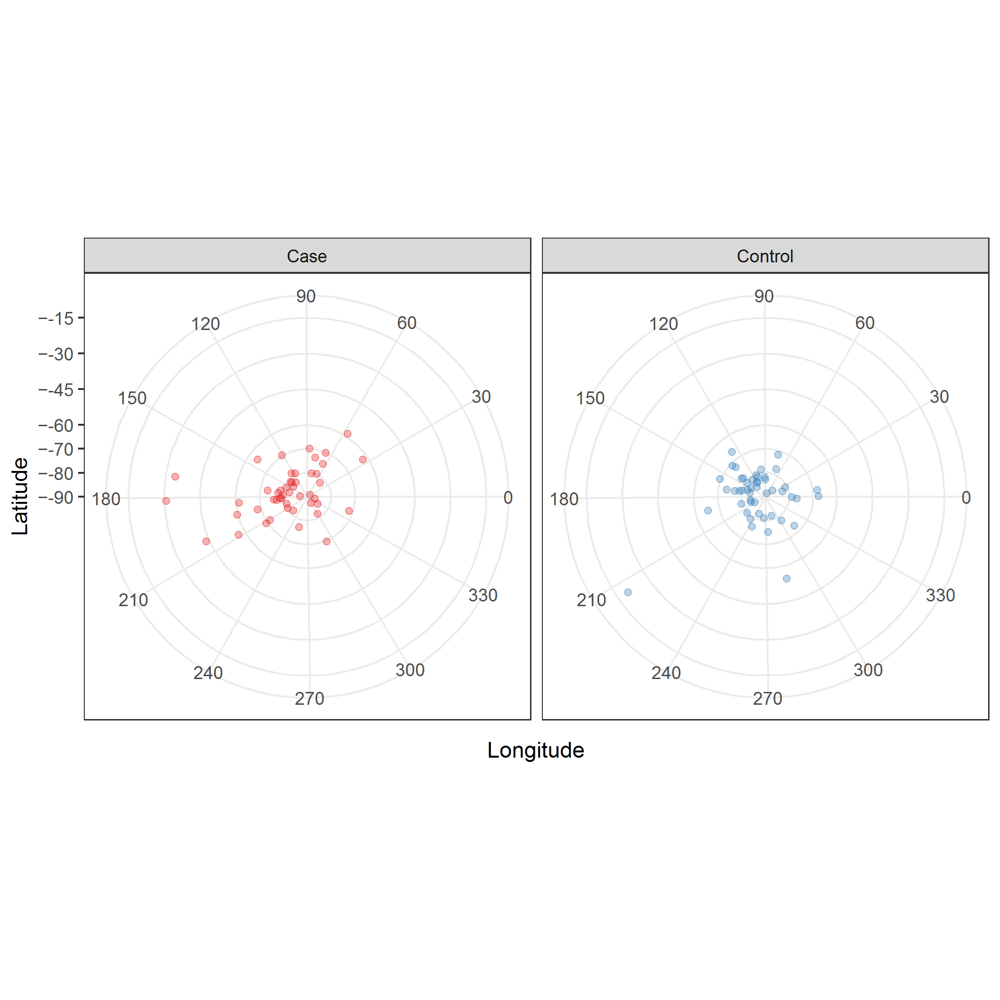
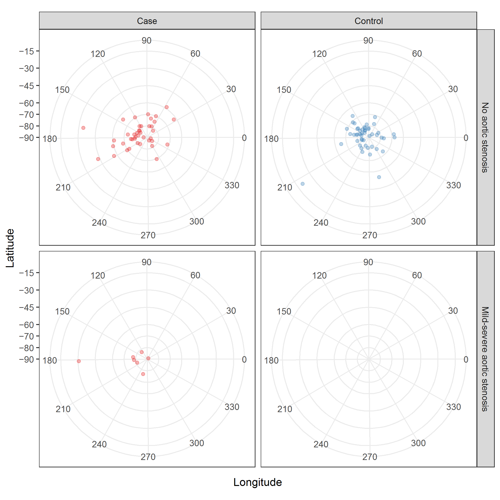
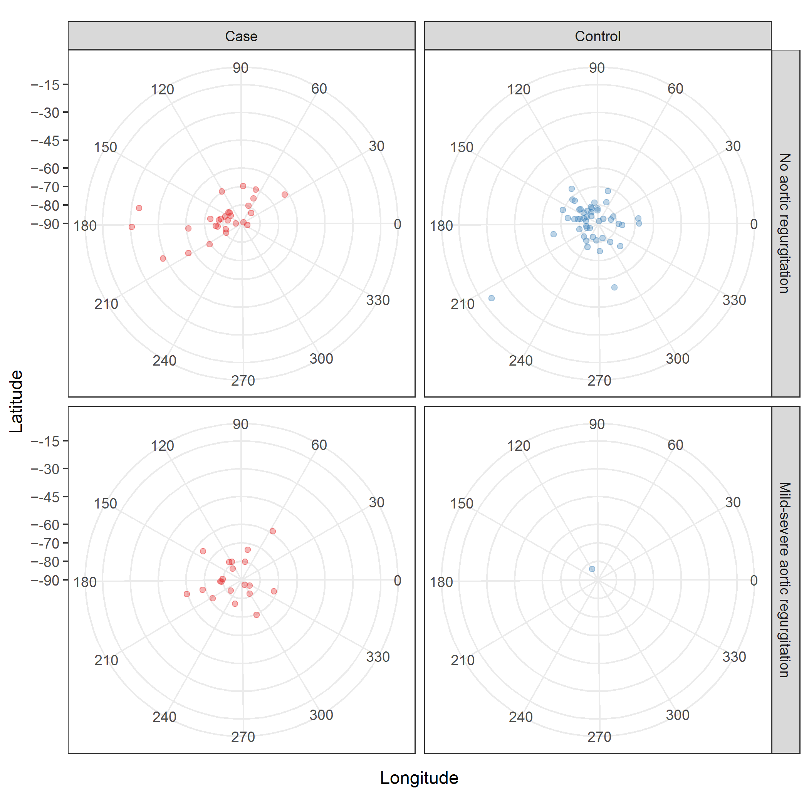

# Directional analysis of coaptation line

Citation for package `Directional`.

```{r}
citation("Directional")
```


## Plots

Spherical coordinates of coaptation lines

### Overall 

[PNG](../figures/plotSpherical.png), [SVG](../figures/plotSpherical.svg)



```{r plotSpherical, dpi = 300, fig.show = "hide"}
df %>%
  select(matches("^id|^type$|^(lat|long|magn)itude$")) %>%
  ggplot +
  aes(x = longitude, y = latitude, color = type) +
  geom_point(alpha = 1/3) +
  scale_y_continuous("Latitude",
                     breaks = c(seq(-90, -70, 10), seq(-60, 0, 15)),
                     limits = c(-90, -15),
                     labels = c(sprintf("\u2212%d", abs(c(seq(-90, -70, 10), seq(-60, -15, 15)))), "0")) +
  scale_color_brewer("Group", palette = "Set1") +
  scale_x_continuous("Longitude", breaks = seq(0, 360, 30), limits = c(0, 359)) +
  coord_polar(start = -pi / 2, direction = -1) +
  facet_wrap( ~ type) + 
  theme_bw() +
  theme(legend.position = "none",
        panel.grid.minor = element_blank(),
        plot.title = element_text(hjust = 0.5))
ggsave("../figures/plotSpherical.png", dpi = 300)
ggsave("../figures/plotSpherical.svg", dpi = 300)
```

### By aortic stenosis

[PNG](../figures/plotSphericalStenosis.png), [SVG](../figures/plotSphericalStenosis.svg)



```{r plotSphericalStenosis, dpi = 300, fig.show = "hide"}
df %>%
  select(matches("^id|^type$|^(lat|long|magn)itude$|^(as)")) %>%
  ggplot +
  aes(x = longitude, y = latitude, color = type) +
  geom_point(alpha = 1/3) +
  scale_y_continuous("Latitude",
                     breaks = c(seq(-90, -70, 10), seq(-60, 0, 15)),
                     limits = c(-90, -15),
                     labels = c(sprintf("\u2212%d", abs(c(seq(-90, -70, 10), seq(-60, -15, 15)))), "0")) +
  scale_color_brewer("Group", palette = "Set1") +
  scale_x_continuous("Longitude", breaks = seq(0, 360, 30), limits = c(0, 359)) +
  coord_polar(start = -pi / 2, direction = -1) +
  facet_grid(as ~ type) + 
  theme_bw() +
  theme(legend.position = "none",
        panel.grid.minor = element_blank(),
        plot.title = element_text(hjust = 0.5))
ggsave("../figures/plotSphericalStenosis.png", dpi = 300)
ggsave("../figures/plotSphericalStenosis.svg", dpi = 300)
```

### By aortic regurgitation

[PNG](../figures/plotSphericalRegurgitation.png), [SVG](../figures/plotSphericalRegurgitation.svg)



```{r plotSphericalRegurgitation, dpi = 300, fig.show = "hide"}
df %>%
  select(matches("^id|^type$|^(lat|long|magn)itude$|^(ar)")) %>%
  ggplot +
  aes(x = longitude, y = latitude, color = type) +
  geom_point(alpha = 1/3) +
  scale_y_continuous("Latitude",
                     breaks = c(seq(-90, -70, 10), seq(-60, 0, 15)),
                     limits = c(-90, -15),
                     labels = c(sprintf("\u2212%d", abs(c(seq(-90, -70, 10), seq(-60, -15, 15)))), "0")) +
  scale_color_brewer("Group", palette = "Set1") +
  scale_x_continuous("Longitude", breaks = seq(0, 360, 30), limits = c(0, 359)) +
  coord_polar(start = -pi / 2, direction = -1) +
  facet_grid(ar ~ type) + 
  theme_bw() +
  theme(legend.position = "none",
        panel.grid.minor = element_blank(),
        plot.title = element_text(hjust = 0.5))
ggsave("../figures/plotSphericalRegurgitation.png", dpi = 300)
ggsave("../figures/plotSphericalRegurgitation.svg", dpi = 300)
```

Create data matrices.

```{r}
vecCoord <- df %>% select(matches("^type$|(coapUnit[XYZ])"))
cirCoord <- df %>% select(matches("^type$|^a[sr]$|((lat)|(long))itude"))
latlon <- "((lat)|(long))itude"
matAll <- cirCoord %>% select(matches(latlon)) %>% as.matrix
matCases <- cirCoord %>% filter(type == "Case") %>% select(matches(latlon)) %>% as.matrix
matControls <- cirCoord %>% filter(type == "Control") %>% select(matches(latlon)) %>% as.matrix
matAS0 <- cirCoord %>% filter(unclass(as) == 1) %>% select(matches(latlon)) %>% as.matrix
matAS1 <- cirCoord %>% filter(unclass(as) == 2) %>% select(matches(latlon)) %>% as.matrix
matAR0 <- cirCoord %>% filter(unclass(ar) == 1) %>% select(matches(latlon)) %>% as.matrix
matAR1 <- cirCoord %>% filter(unclass(ar) == 2) %>% select(matches(latlon)) %>% as.matrix
```

Test whether Kent's ovalness parameter (beta) is equal to zero.
The null hypothesis is whether a von Mises-Fisher distribution fits the data well. 
The altenrative is that Kent distribution is more suitable.

```{r}
test <- vecCoord %>% select(-1) %>% as.matrix %>% fishkent
message(sprintf("Bootstrap p-value is %.04f\n%s null hypothesis",
                test[["Bootstrap p-value"]],
                ifelse(test[["Bootstrap p-value"]] < 0.05, "Reject", "Fail to reject")))
```

## Circular summary statistics

```{r}
data.frame(type = c("All",
                    "Cases", "Controls",
                    "Aortic stenosis: none-trivial", "Aortic stenosis: mild-severe",
                    "Aortic regurgitation: none-trivial", "Aortic regurgitation: mild-severe"),
           latitude = c(matAll[, "latitude"] %>% 
                          circ.summary(rads = FALSE, plot = FALSE) %>% 
                          .[["mesos"]],
                        matCases[, "latitude"] %>% 
                          circ.summary(rads = FALSE, plot = FALSE) %>% 
                          .[["mesos"]],
                        matControls[, "latitude"] %>% 
                          circ.summary(rads = FALSE, plot = FALSE) %>% 
                          .[["mesos"]],
                        matAS0[, "latitude"] %>% 
                          circ.summary(rads = FALSE, plot = FALSE) %>% 
                          .[["mesos"]],
                        matAS1[, "latitude"] %>% 
                          circ.summary(rads = FALSE, plot = FALSE) %>% 
                          .[["mesos"]],
                        matAR0[, "latitude"] %>% 
                          circ.summary(rads = FALSE, plot = FALSE) %>% 
                          .[["mesos"]],
                        matAR1[, "latitude"] %>% 
                          circ.summary(rads = FALSE, plot = FALSE) %>% 
                          .[["mesos"]]),
           longitude = c(matAll[, "longitude"] %>% 
                           circ.summary(rads = FALSE, plot = FALSE) %>% 
                           .[["mesos"]],
                         matCases[, "longitude"] %>% 
                           circ.summary(rads = FALSE, plot = FALSE) %>% 
                           .[["mesos"]],
                         matControls[, "longitude"] %>% 
                           circ.summary(rads = FALSE, plot = FALSE) %>% 
                           .[["mesos"]],
                        matAS0[, "longitude"] %>% 
                          circ.summary(rads = FALSE, plot = FALSE) %>% 
                          .[["mesos"]],
                        matAS1[, "longitude"] %>% 
                          circ.summary(rads = FALSE, plot = FALSE) %>% 
                          .[["mesos"]],
                        matAR0[, "longitude"] %>% 
                          circ.summary(rads = FALSE, plot = FALSE) %>% 
                          .[["mesos"]],
                        matAR1[, "longitude"] %>% 
                          circ.summary(rads = FALSE, plot = FALSE) %>% 
                          .[["mesos"]])) %>% kable
```


## ANOVA

There does not appear to be statistically different directions by 
group (case vs control), 
aortic stenosis (none-trivial vs mild-severe), or 
aortic regurgitation (none-trivial vs mild-severe). 

```{r}
data.frame(effect = c("Group: case vs control",
                      "Aortic stenosis: none-trivial vs mild-severe",
                      "Aortic regurgitation: none-trivial vs mild-severe"),
           bind_rows(hcf.aov(df %>% select(matches("coapUnit[XYZ]")), factor(df$type)) %>% t %>% data.frame,
                     hcf.aov(df %>% select(matches("coapUnit[XYZ]")), factor(df$as)) %>% t %>% data.frame,
                     hcf.aov(df %>% select(matches("coapUnit[XYZ]")), factor(df$ar)) %>% t %>% data.frame)) %>% 
  kable
```


```{r, eval = FALSE}
data.frame(variable = rep(c("Latitude", "Longitude"), 3),
           effect = c(rep("Group: case vs control", 2), 
                      rep("Aortic stenosis: none-trivial vs mild-severe", 2), 
                      rep("Aortic regurgitation: none-trivial vs mild-severe", 2)),
           bind_rows(matAll[, "latitude"] %>% 
                       lr.circaov(., factor(df$type), rads = FALSE) %>% 
                       t %>% data.frame,
                     matAll[, "longitude"] %>% 
                       lr.circaov(., factor(df$type), rads = FALSE) %>% 
                       t %>% data.frame,
                     matAll[, "latitude"] %>% 
                       lr.circaov(., factor(df$as), rads = FALSE) %>% 
                       t %>% data.frame,
                     matAll[, "longitude"] %>% 
                       lr.circaov(., factor(df$as), rads = FALSE) %>% 
                       t %>% data.frame,
                     matAll[, "latitude"] %>% 
                       lr.circaov(., factor(df$ar), rads = FALSE) %>% 
                       t %>% data.frame,
                     matAll[, "longitude"] %>% 
                       lr.circaov(., factor(df$ar), rads = FALSE) %>% 
                       t %>% data.frame)) %>% 
  kable
```


## Circular regression for latitude (polar angle)

Unadjusted.

```{r}
new <- df$typeCase %>% unique
M <- spml.reg(df$latitude, 
              as.matrix(df[, "typeCase"]), 
              rads = FALSE, 
              xnew = as.matrix(new))
M
data.frame(type = df$type %>% unique, 
           typeCase = new,
           pred = as.vector(M$est) - 360) %>% kable
```

Adjusted for body surface area.

```{r}
new <- data.frame(typeCase = rep(df$typeCase %>% unique, 3), 
                  bsaScaled = rep(-1:1, each = 2))
M <- spml.reg(df$latitude, 
              as.matrix(df[, c("typeCase", "bsaScaled")]), 
              rads = FALSE, 
              xnew = as.matrix(new))
M
data.frame(type = rep(df$type %>% unique, 3),
           new,
           scaling = rep(c("-1 SD from mean BSA",
                           "Mean BSA",
                           "+1 SD from mean BSA"), each = 2),
           pred = as.vector(M$est) - 360) %>% kable
```

Adjusted for orifice area area.

```{r}
new <- data.frame(typeCase = rep(df$typeCase %>% unique, 3), 
                  orificeAreaScaled = rep(-1:1, each = 2))
M <- spml.reg(df$latitude, 
              as.matrix(df[, c("typeCase", "orificeAreaScaled")]), 
              rads = FALSE, 
              xnew = as.matrix(new))
M
data.frame(type = rep(df$type %>% unique, 3),
           new,
           scaling = rep(c("-1 SD from mean orifice area",
                           "Mean orifice area",
                           "+1 SD from mean orifice area"), each = 2),
           pred = as.vector(M$est) - 360) %>% kable
```

Adjusted for coaptation line length.

```{r}
new <- data.frame(typeCase = rep(df$typeCase %>% unique, 3), 
                  magnitudeScaled = rep(-1:1, each = 2))
M <- spml.reg(df$latitude, 
              as.matrix(df[, c("typeCase", "magnitudeScaled")]), 
              rads = FALSE, 
              xnew = as.matrix(new))
M
data.frame(type = rep(df$type %>% unique, 3),
           new,
           scaling = rep(c("-1 SD from mean coaptation line length",
                           "Mean coaptation line length",
                           "+1 SD from mean coaptation line length"), each = 2),
           pred = as.vector(M$est) - 360) %>% kable
```

## Circular regression for longitude (azimuthal angle)

Unadjusted.

```{r}
new <- df$typeCase %>% unique
M <- spml.reg(df$longitude, 
              as.matrix(df[, "typeCase"]), 
              rads = FALSE, 
              xnew = as.matrix(new))
M
data.frame(type = df$type %>% unique, 
           typeCase = new,
           pred = as.vector(M$est)) %>% kable
```

Adjusted for body surface area.

```{r}
new <- data.frame(typeCase = rep(df$typeCase %>% unique, 3), 
                  bsaScaled = rep(-1:1, each = 2))
M <- spml.reg(df$longitude, 
              as.matrix(df[, c("typeCase", "bsaScaled")]), 
              rads = FALSE, 
              xnew = as.matrix(new))
M
data.frame(type = rep(df$type %>% unique, 3),
           new,
           scaling = rep(c("-1 SD from mean BSA",
                           "Mean BSA",
                           "+1 SD from mean BSA"), each = 2),
           pred = as.vector(M$est)) %>% kable
```

Adjusted for orifice area area.

```{r}
new <- data.frame(typeCase = rep(df$typeCase %>% unique, 3), 
                  orificeAreaScaled = rep(-1:1, each = 2))
M <- spml.reg(df$longitude, 
              as.matrix(df[, c("typeCase", "orificeAreaScaled")]), 
              rads = FALSE, 
              xnew = as.matrix(new))
M
data.frame(type = rep(df$type %>% unique, 3),
           new,
           scaling = rep(c("-1 SD from mean orifice area",
                           "Mean orifice area",
                           "+1 SD from mean orifice area"), each = 2),
           pred = as.vector(M$est)) %>% kable
```

Adjusted for coaptation line length.

```{r}
new <- data.frame(typeCase = rep(df$typeCase %>% unique, 3), 
                  magnitudeScaled = rep(-1:1, each = 2))
M <- spml.reg(df$longitude, 
              as.matrix(df[, c("typeCase", "magnitudeScaled")]), 
              rads = FALSE, 
              xnew = as.matrix(new))
M
data.frame(type = rep(df$type %>% unique, 3),
           new,
           scaling = rep(c("-1 SD from mean coaptation line length",
                           "Mean coaptation line length",
                           "+1 SD from mean coaptation line length"), each = 2),
           pred = as.vector(M$est)) %>% kable
```
