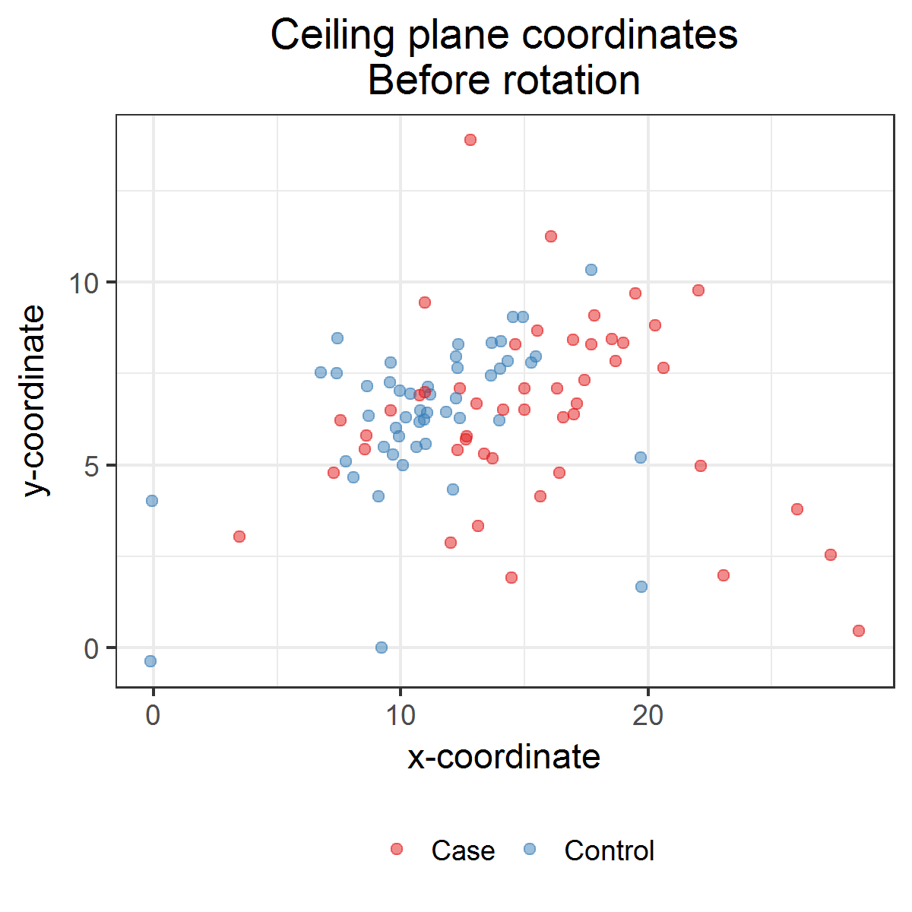

# Compare ceiling plane coordinates

Observed ceiling plane coordinates (before rotation).

[PNG](../figures/plotCeilingPlaneCoordinates.png), [SVG](../figures/plotCeilingPlaneCoordinates.svg)



```{r plotCeilingPlaneCoordinates, fig.show = "hide"}
df %>% 
  ggplot +
  aes(x = centroidCalcX, y = centroidCalcY, color = type) +
  geom_point(alpha = 1/2) +
  # geom_rug(alpha = 1/2) +
  scale_x_continuous("x-coordinate") +
  scale_y_continuous("y-coordinate") +
  scale_color_brewer("", palette = "Set1") +
  labs(title = "Ceiling plane coordinates\nBefore rotation", hjust = 0.5) +
  theme_bw() +
  theme(legend.position = "bottom",
        plot.title = element_text(hjust = 0.5))
ggsave("../figures/plotCeilingPlaneCoordinates.png", dpi = 300, units = "in", width = 4, height = 4)
ggsave("../figures/plotCeilingPlaneCoordinates.svg", dpi = 300, units = "in", width = 4, height = 4)
```

Calculate predicted ceiling plane coordinates from MANOVA.
Adjust for scaled orifice area, `orificeAreaScaled`.

```{r}
M <-
  df %>% 
  select(centroidCalcX, centroidCalcY, type, orificeAreaScaled) %>% 
  manova(cbind(centroidCalcX, centroidCalcY) ~ type + orificeAreaScaled, data = .)
newdata <- data.frame(type = c("Case", "Control"), orificeAreaScaled = rep(0, 2))
pred <- 
  bind_cols(newdata,
            M %>% predict(newdata = newdata) %>% round(2) %>% data.frame)
pred %>% kable
```

**Ceiling plane coordinates (before rotation) are `r paste0(isSig(M %>% tidy %>% filter(term == "type") %>% .[, "p.value"]), "ly")` different (p = `r sprintf("%.03f", M %>% tidy %>% filter(term == "type") %>% .[, "p.value"])`).**

Show MANOVA details.

```{r}
M %>% tidy %>% kable
summary.aov(M)
```
