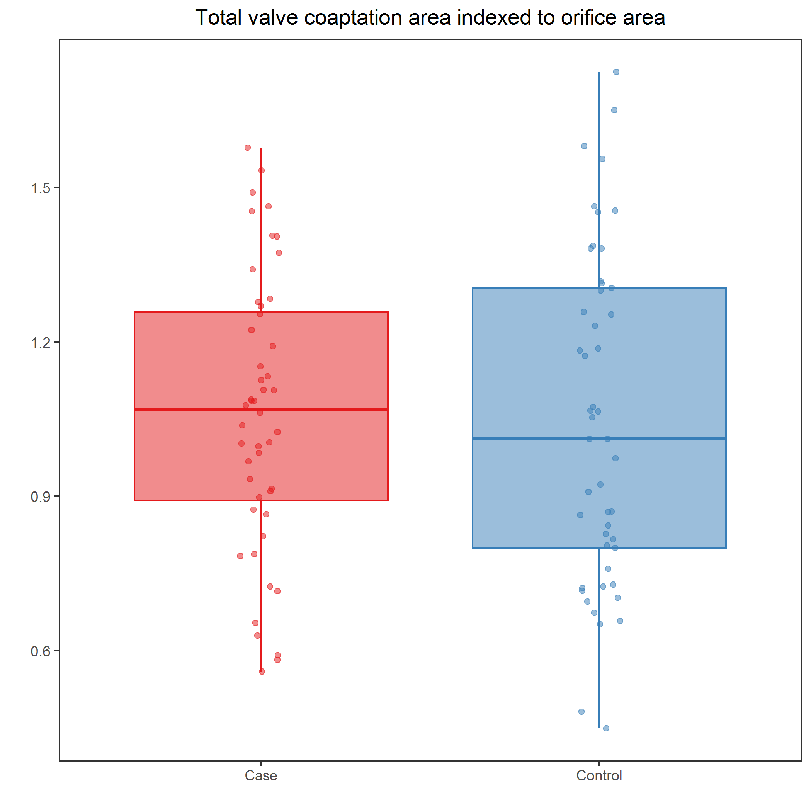
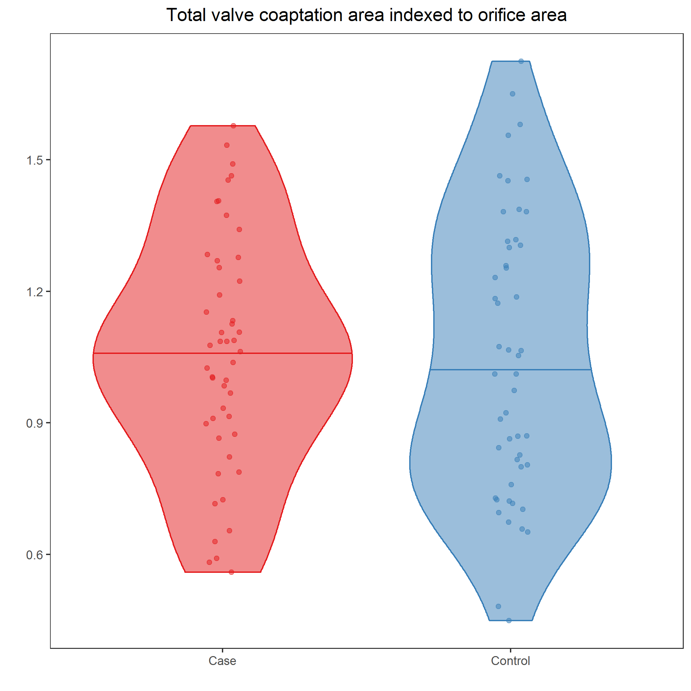
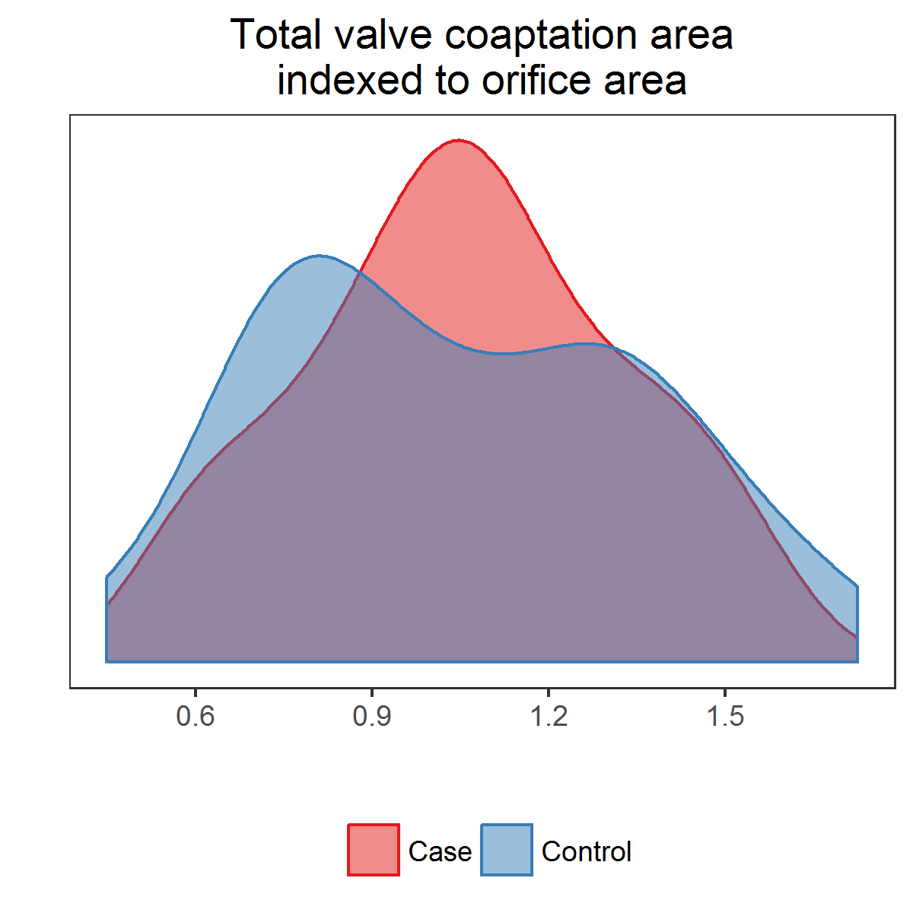

# Compare total coaptation areas

[PNG](../figures/boxplotsTotalCoaptationArea.png), [SVG](../figures/boxplotsTotalCoaptationArea.svg)



```{r boxplotsTotalCoaptationArea, fig.show = "hide"}
var <- "^id|^type$|a_coap_orifice_area"
df1 <-
  df %>%
  select(matches(var)) %>%
  mutate(type = factor(type))
df1 %>% 
  ggplot +
    aes(x = type, y = a_coap_orifice_area, color = type, fill = type) +
    geom_boxplot(alpha = 1/2) +
    geom_jitter(alpha = 1/2, width = 1/16, height = 0) +
    scale_x_discrete("") +
    scale_y_continuous("") +
    scale_color_brewer("", palette = "Set1") +
    scale_fill_brewer("", palette = "Set1") +
    labs(title = "Total valve coaptation area\nindexed to orifice area") + 
    theme_bw() +
    theme(legend.position = "none",
          panel.grid = element_blank(),
          plot.title = element_text(hjust = 0.5))
ggsave("../figures/boxplotsTotalCoaptationArea.png", dpi = 300, units = "in", width = 4, height = 4)
ggsave("../figures/boxplotsTotalCoaptationArea.svg", dpi = 300, units = "in", width = 4, height = 4)
```

[PNG](../figures/violinplotsTotalCoaptationArea.png), [SVG](../figures/violinplotsTotalCoaptationArea.svg)



```{r violinplotsTotalCoaptationArea, fig.show = "hide"}
df1 %>% 
  ggplot +
    aes(x = type, y = a_coap_orifice_area, color = type, fill = type) +
    geom_violin(alpha = 1/2, draw_quantiles = 0.5) +
    geom_jitter(alpha = 1/2, width = 1/16, height = 0) +
    scale_x_discrete("") +
    scale_y_continuous("") +
    scale_color_brewer("", palette = "Set1") +
    scale_fill_brewer("", palette = "Set1") +
    labs(title = "Total valve coaptation area\nindexed to orifice area") + 
    theme_bw() +
    theme(legend.position = "none",
          panel.grid = element_blank(),
          plot.title = element_text(hjust = 0.5))
ggsave("../figures/violinplotsTotalCoaptationArea.png", dpi = 300, units = "in", width = 4, height = 4)
ggsave("../figures/violinplotsTotalCoaptationArea.svg", dpi = 300, units = "in", width = 4, height = 4)
```

[PNG](../figures/densityTotalCoaptationArea.png), [SVG](../figures/densityTotalCoaptationArea.svg)



```{r densityTotalCoaptationArea, fig.show = "hide"}
df1 %>% 
  ggplot +
    aes(x = a_coap_orifice_area, color = type, fill = type) +
    geom_density(alpha = 1/2) +
    scale_x_continuous("") +
    scale_y_continuous("", labels = NULL) +
    scale_color_brewer("", palette = "Set1") +
    scale_fill_brewer("", palette = "Set1") +
    labs(title = "Total valve coaptation area\nindexed to orifice area") + 
    theme_bw() +
    theme(legend.position = "bottom",
          panel.grid = element_blank(),
          axis.ticks.y = element_blank(),
          plot.title = element_text(hjust = 0.5))
ggsave("../figures/densityTotalCoaptationArea.png", dpi = 300, units = "in", width = 4, height = 4)
ggsave("../figures/densityTotalCoaptationArea.svg", dpi = 300, units = "in", width = 4, height = 4)
```

