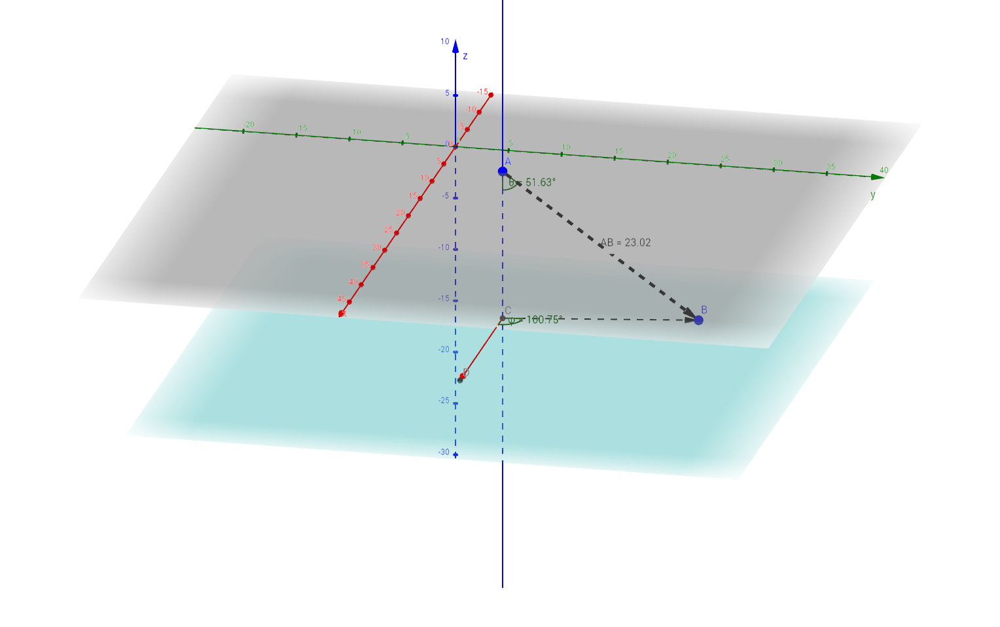

# Read anonymized data

Read and clean data.
R code is suppressed for brevity.
See [`read.Rmd`](../scripts/read.Rmd) for full details.

1. Read the Excel file
1. Rename columns
1. Remove patients with missing values for `nl`, `rl`, and `ln`
  * 2 cases, 1 control
1. Remove extraneous columns
1. Fix sign of `centroidBottomZ`
  * All values should be $<0$; a few were $>0$
1. Rotate the calculated centroid coordinates relative to "north", as defined by `nstar_X` and `nstar_Y`.
  * Rotate both the calculated and bottom centroids
1. Convert cartesian coordinates of rotated coaptation line to spherical coordinates
  * See function [`cart2sph`](../lib/cart2sph.R)
  * $\rho$ = radial distance
  * $\theta$ = polar angle (inclination) bounded between $(\frac{-\pi}{2}, \frac{\pi}{2})$ or $(-90^{\circ}, +90^{\circ})$; default units is radians
  * $\phi$ = azimuthal angle bounded between $(-\pi, \pi)$ or $(-180^{\circ}, +180^{\circ})$; default units is radians
  * $\rho, \theta, \phi$ will be used to describe the coaptation line
1. Normalize the orientation of the coaptation line to the unit sphere
1. Scale body size measures, `bsa` and `orifice_area`, to have mean = 0 and SD = 1

Example coaptation line (triple point) is below.
An interactive representation of the coaptation line geometry is [here](https://ggbm.at/CeF95YMN).



```{r}
f <- file.path("C:/Users/chanb/Box Sync/PrintValveGroup AnonymyzedData",
               "Anonymyized.Consolidated Validated Spreadsheet, missing some BSAs.xlsx")
df <-
  read_excel(f, col_names = FALSE, skip = 1, na = "x") %>% 
  rename(id = X0,
         type = X1,
         randid = X2,
         studydate = X3,
         gender = X4,
         pmh = X5,
         ct_surgeries = X6,
         hx_stroke = X7,
         clinic_visit_date = X8,
         bp = X9,
         anti_htn_meds = X10,
         date_of_echo = X11,
         days_b_w_echo_cmr = X12,
         aov_velocity = X13,
         date_of_cmr = X14,
         aov_morphology = X15,
         diagnosis = X16,
         ar = X17,
         as = X18,
         lvedv = X19,
         lvedvi = X20,
         lvesv = X21,
         lvesvi = X22,
         ef = X23,
         ht = X24,
         wt = X25,
         bsa = X26,
         nr = X27,
         nr_frac = X28,
         rl = X29,
         rl_frac = X30,
         ln = X31,
         ln_frac = X32,
         total_area_value = X33,
         total_area = X34,
         orifice_area = X35,
         valve_diameter = X36,
         valve_area = X37,
         a_coap_size_valve = X38,
         a_coap_orifice_area = X39,
         a_coap_valve_area = X40,
         mimics_notes = X41,
         three_matic_notes = X42,
         type2 = X43,
         xybavtype = X44,
         xyaortopathY = X45,
         centroidCalcX = X46,
         centroidCalcY = X47,
         centroidGeoX = X48,
         centroidGeoY = X49,
         centroidBottomX = X50,
         centroidBottomY = X51,
         centroidBottomZ = X52,
         nstar_X = X53,
         nstar_Y = X54,
         coapt_line_length = X55) %>% 
  filter(!is.na(nr) & !is.na(rl) & !is.na(ln)) %>% 
  select(-matches("type2")) %>%
  mutate(centroidBottomZ = -abs(centroidBottomZ)) %>%
  mutate(dotProd =
           normalize(centroidCalcX, centroidCalcY) * normalize(nstar_X, nstar_Y) +
           normalize(centroidCalcY, centroidCalcX) * normalize(nstar_Y, nstar_X),
         rotation = acos(dotProd),  # Radians
         rotationDeg = rotation * (180 / pi),
         centroidCalcRotatedX = centroidCalcX * cos(rotation) - centroidCalcY * sin(rotation),
         centroidCalcRotatedY = centroidCalcX * sin(rotation) + centroidCalcY * cos(rotation),
         centroidBottomRotatedX = centroidBottomX * cos(rotation) - centroidBottomY * sin(rotation),
         centroidBottomRotatedY = centroidBottomX * sin(rotation) + centroidBottomY * cos(rotation)) %>% 
  bind_cols(cart2sph(cbind(.$centroidCalcRotatedX, .$centroidCalcRotatedY, .$centroidBottomZ),
                     cbind(.$centroidBottomRotatedX, .$centroidBottomRotatedY, 0),
                     units = "deg")) %>%
  mutate(coapUnitX = (centroidCalcRotatedX - centroidBottomRotatedX) / radial,
         coapUnitY = (centroidCalcRotatedY - centroidBottomRotatedY) / radial,
         coapUnitZ = (centroidBottomZ) / radial) %>% 
  mutate(bsaScaled = as.vector(scale(bsa)),
         orificeAreaScaled = as.vector(scale(orifice_area)))
```

Check calculation of `radial` against given `coapt_line_length`; it should be 1.0

```{r}
message(sprintf("Correlation between coapt_line_length and calculated radial is: %.05f",
                cor(df$coapt_line_length, df$radial, use = "complete.obs")))
```

Check correlation between body surface area, `bsa`, and other size variables.

```{r}
df %>% 
  select(matches("bsa|area|diam|size|radial")) %>% 
  cor(use = "complete") %>% 
  data.frame %>%
  select(1) %>%
  kable
```

Scale the size variables by `bsa`.

```{r, echo = TRUE}
df <- 
  df %>%
  mutate(total_area_valueScaled = total_area_value / bsa,
         total_areaScaled = total_area / bsa,
         orifice_areaScaled = orifice_area / bsa,
         valve_diameterScaled = valve_diameter / bsa,
         valve_areaScaled = valve_area / bsa,
         radialScaled = radial / bsa)
```

Output a subset for spot-checking.

```{r}
var <- "centroid[(Calc)|(Bottom)]|nstar|rotation|coapt|radial|polar|azimuthal"
f <- "../data/processed/sphericalCoordinates.csv"
df %>%
  sample_n(5) %>%
  select(matches(var)) %>% 
  write.csv(file = f, row.names = FALSE, na = "")
message(sprintf("File %s was written on %s", f, file.mtime(f)))
```

Summarize the entire data set.

```{r}
df %>% group_by(type) %>% tally %>% kable
# summary(df)
```
